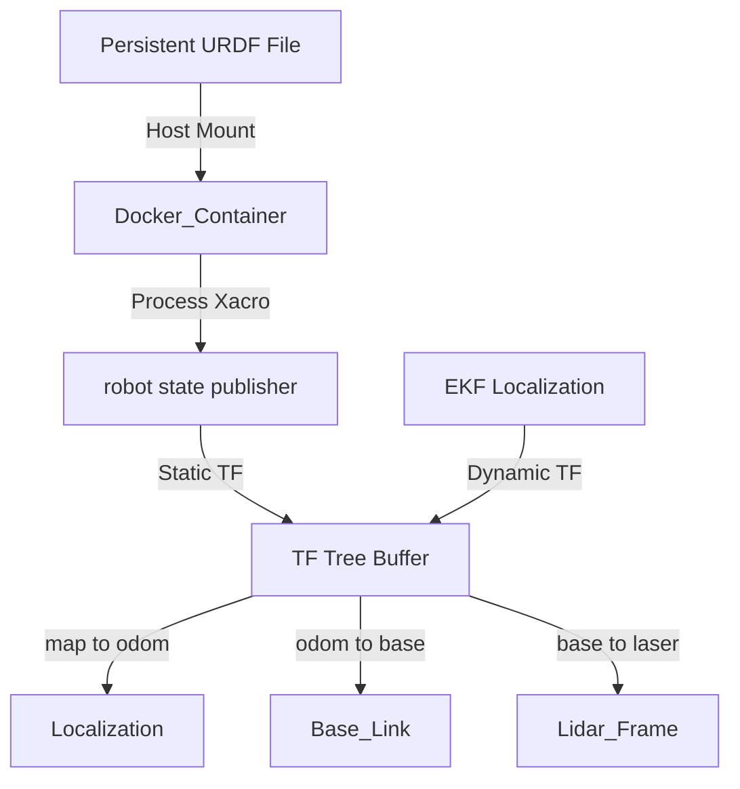

# Wildbot URDF 與感測器座標配置指南

## 1. 專案概述 (Overview)
本實作解決了機器人模型在 Docker 容器重啟後修改丟失的問題，並成功建立完整的機器人坐標鏈（TF Tree）。透過將雷達（LiDAR）座標持久化定義於 URDF 中，確保 SLAM 與導航系統能正確獲取感測器空間位置。

## 2. 技術棧與環境 (Tech Stack)
- **核心框架**: ROS 2 Jazzy
- **建模語言**: Xacro / URDF (XML 格式)
- **核心節點**: `robot_state_publisher`
- **虛擬化工具**: Docker Compose (具備持久化掛載功能)

## 3. 系統架構流程圖 (Architecture)
展示了座標系是如何透過模型與動態數據結合，形成完整的空間認知：



> **連線說明**:
> - Host Mount: 將宿主機修正後的檔案掛載進容器
> - Process Xacro: 將模型參數轉化為 XML
> - Static TF: 不會變動的硬體位置資訊
> - Dynamic TF: 隨機器人移動產生的位置資訊
> - map to odom: 地圖與里程計之間的修正
> - odom to base: 機器人與里程計原點的相對位置
> - base to laser: 雷達在機器人上的安裝位置

## 4. 核心邏輯與程式碼 (Core Implementation)

### A. 持久化 URDF 定義 (`kros_car_persistent.xacro`)
這是最終修正後的感測器定義區塊，確保雷達座標 `laser` 被正確連結至機器人中心 `base_link`。

```xml
<!-- 定義雷達連結 (Laser Link) -->
<link name="laser"/>

<!-- 定義雷達與底盤的關節 (Laser Joint) -->
<joint name="laser_joint" type="fixed">
    <parent link="base_link"/>
    <child link="laser"/>
    <!-- XYZ: 前後 10cm, 左右 0, 高度 15cm; RPY: 無旋轉 -->
    <origin xyz="0.1 0 0.15" rpy="0 0 0"/>
</joint>
```

### B. Docker Compose 持久化掛載
透過 `volumes` 將宿主機的修正檔強制覆蓋容器內的映像檔內容，實現「改一次，永遠生效」。

```yaml
# docker-compose_kros_car.yml 關鍵片段
services:
  kros_car:
    volumes:
      # 前者為宿主機路徑，後者為容器內路徑
      - ./workspaces/kros_car_persistent.xacro:/robot_ws/src/wildbot-car-description/urdf/kros_car.xacro
```

## 5. 執行與操作步驟 (How to Run)

1. **套用模型變更**:
   若有修改 `kros_car_persistent.xacro` 中的偏移量（xyz），請執行重啟腳本：
   ```bash
   sudo ./scripts/00_start_all.sh
   ```

2. **驗證座標鏈是否完整**:
   執行 TF 監測工具，確認 `laser` 座標是否已連線：
   ```bash
   # 在容器內執行
   ros2 run tf2_ros tf2_echo base_link laser
   ```

3. **生成架構圖檔**:
   使用 `view_frames` 工具導出當前的 PDF 結構圖：
   ```bash
   ros2 run tf2_tools view_frames
   ```

## 6. 已知問題與後續擴充 (Next Steps)
- **座標精確度**: 目前 `origin xyz="0.1 0 0.15"` 為估計值，建議後續使用捲尺測量實際安裝高度後進行微調。
- **相機座標補完**: 目前僅定義雷達座標，後續可依此模式加入 `camera_link` 的 URDF 定義。
- **IMU 座標對齊**: 需確認 IMU 是否安裝在機器人正中心，若有偏移也應在此檔案中定義。
