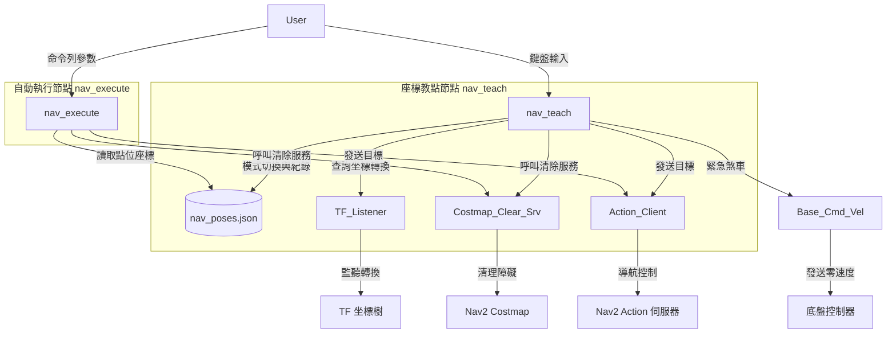

# 🤖 Wildbot Nav2 座標校點與自動巡航系統技術筆記

---

## 1. 專案概述 (Overview)
本實作旨在為 Wildbot 實體小車建立一套輕量、易用的 **Nav2 座標校點 (Teach)** 與 **自動巡航執行 (Execute)** 工具。

此套件解決了實體小車部署時，需手動於地圖估算座標、編寫硬編碼 (Hard-coded) 巡航點位的痛點，並結合了非阻塞式 Action 狀態監聽與導航前自動清理 Costmap 幽靈障礙物的機制，確保小車在複雜競賽環境中的自主導航精度與穩定性。

---

## 2. 執行與操作步驟 (How to Run)

### A. 環境編譯與載入
```bash
# 1. 進入實體小車執行容器
docker exec -it compose-kros_car-1 bash

# 2. 進入 workspaces 編譯 arm_ik 套件
cd /workspaces
colcon build --packages-select arm_ik

# 3. 載入工作空間環境變數
source /workspaces/install/setup.bash
```

### B. 啟動座標教導與校點工具 (nav_teach)
```bash
ros2 run arm_ik nav_teach
```
*   **模式切換**：按下鍵盤 `R` 鍵，可在「紀錄模式」與「回放模式」間自由切換。
*   **紀錄模式**：將小車推至關鍵點，按 `0` - `9` 數字鍵，系統會自動透過 TF 取得目前 `map -> base_link` 坐標並寫入 `nav_poses.json`。
*   **回放模式**：按 `0` - `9` 數字鍵，小車將調用 Nav2 自動規劃路徑導航至對應紀錄點。
*   **輔助按鍵**：`I` 查看當前坐標，`C` 即時清理 Costmap，`S` 執行緊急底盤煞車，`X` 退出程式。

### C. 執行自動循跡與多點巡航 (nav_execute)
```bash
# 1. 顯示當前 JSON 檔案中所有已儲存的可用座標點與 Yaw 角度
ros2 run arm_ik nav_execute

# 2. 單點自主導航 (例如導航到 1 號點)
ros2 run arm_ik nav_execute 1

# 3. 順序執行多點巡航序列 (例如 1 號點 -> 2 號點 -> 1 號點)
ros2 run arm_ik nav_execute 1 2 1
```

---

## 3. 技術棧與環境 (Tech Stack)
*   **機器人作業系統**：ROS2 Jazzy
*   **底盤控制話題**：`/base_controller/cmd_vel` (`geometry_msgs/msg/Twist`)
*   **定位與座標轉換**：TF2 系統 (`tf2_ros.TransformListener`) 查詢 `map` 到 `base_link`
*   **自主導航服務**：Nav2 Action 協議 (`nav2_msgs/action/NavigateToPose`)
*   **核心語言**：Python 3.12 (與 rclpy API)

---

## 4. 系統架構流程圖 (Architecture)



---

## 5. 核心邏輯與程式碼 (Core Implementation)

### 核心模組一：座標教導與校點工具 (`nav_teach.py`)
利用非阻塞鍵盤 IO 結合 ROS2 的執行緒回呼，實現了隨按隨錄與即時回放功能。

```python
import rclpy
from rclpy.node import Node
from rclpy.action import ActionClient
import sys
import termios
import tty
import select
import math
import json
import os
import time

from geometry_msgs.msg import PoseStamped, Twist
from nav2_msgs.action import NavigateToPose
from action_msgs.msg import GoalStatus
from tf2_ros.buffer import Buffer
from tf2_ros.transform_listener import TransformListener
from std_srvs.srv import Empty

class NavTeach(Node):
    def __init__(self):
        super().__init__('nav_teach')
        
        # 設定儲存點位的 JSON 檔案路徑
        script_dir = os.path.dirname(os.path.abspath(__file__))
        self.pose_file = os.path.join(script_dir, "nav_poses.json")
        self.saved_poses = self.load_poses()
        
        self.recall_mode = False # 是否處於回放/導航模式
        self.current_goal_handle = None
        
        # 初始化 TF 監聽器
        self.tf_buffer = Buffer()
        self.tf_listener = TransformListener(self.tf_buffer, self)
        
        # 初始化 Nav2 導航 Action 客戶端
        self.nav_client = ActionClient(self, NavigateToPose, 'navigate_to_pose')
        
        # 初始化底盤控制速度 Publisher (用於緊急煞車)
        self.cmd_vel_pub = self.create_publisher(Twist, '/base_controller/cmd_vel', 10)
        
        # 初始化 Costmap 清除服務客戶端
        self.clear_local_costmap_client = self.create_client(Empty, '/local_costmap/clear_entirely_local_costmap')
        self.clear_global_costmap_client = self.create_client(Empty, '/global_costmap/clear_entirely_global_costmap')
        
        self.get_logger().info("🤖 Nav2 座標教導/回放工具 - 已啟動")

    def load_poses(self):
        if os.path.exists(self.pose_file):
            try:
                with open(self.pose_file, 'r') as f:
                    return json.load(f)
            except Exception as e:
                self.get_logger().error(f"❌ 載入導航點位失敗: {e}")
        return {}

    def yaw_from_quaternion(self, x, y, z, w):
        siny_cosp = 2.0 * (w * z + x * y)
        cosy_cosp = 1.0 - 2.0 * (y * y + z * z)
        return math.atan2(siny_cosp, cosy_cosp)

    def save_pose(self, slot):
        try:
            # 獲取當前 TF 位姿
            transform = self.tf_buffer.lookup_transform('map', 'base_link', rclpy.time.Time())
            tx = transform.transform.translation.x
            ty = transform.transform.translation.y
            qx = transform.transform.rotation.x
            qy = transform.transform.rotation.y
            qz = transform.transform.rotation.z
            qw = transform.transform.rotation.w
            
            yaw = self.yaw_from_quaternion(qx, qy, qz, qw)
            
            # 寫入 JSON
            self.saved_poses[str(slot)] = {
                'x': tx, 'y': ty,
                'qx': qx, 'qy': qy, 'qz': qz, 'qw': qw,
                'yaw': yaw
            }
            with open(self.pose_file, 'w') as f:
                json.dump(self.saved_poses, f, indent=4)
                
            print(f"\n✅ [已紀錄導航點位 {slot}]: X: {tx:.3f} m, Y: {ty:.3f} m, Yaw: {math.degrees(yaw):.1f}°")
        except Exception as e:
            self.get_logger().error(f"❌ 獲取座標或儲存點位失敗: {e}")

    def move_to_pose(self, slot):
        slot_str = str(slot)
        if slot_str not in self.saved_poses:
            print(f"⚠️ 點位 {slot} 尚未紀錄")
            return
            
        pose_data = self.saved_poses[slot_str]
        pose = PoseStamped()
        pose.header.frame_id = 'map'
        pose.header.stamp = self.get_clock().now().to_msg()
        pose.pose.position.x = pose_data['x']
        pose.pose.position.y = pose_data['y']
        pose.pose.orientation.x = pose_data['qx']
        pose.pose.orientation.y = pose_data['qy']
        pose.pose.orientation.z = pose_data['qz']
        pose.pose.orientation.w = pose_data['qw']
        
        self.send_nav_goal(pose)

    def send_nav_goal(self, pose):
        if self.current_goal_handle is not None:
            self.current_goal_handle.cancel_goal_async()
        self.nav_client.wait_for_server()
        goal_msg = NavigateToPose.Goal()
        goal_msg.pose = pose
        self._send_goal_future = self.nav_client.send_goal_async(goal_msg)
        self._send_goal_future.add_done_callback(self.nav_goal_response_cb)

    def nav_goal_response_cb(self, future):
        goal_handle = future.result()
        if not goal_handle.accepted:
            print("❌ 導航目標被拒絕")
            return
        self.current_goal_handle = goal_handle
        self._get_result_future = goal_handle.get_result_async()
        self._get_result_future.add_done_callback(self.nav_result_cb)

    def nav_result_cb(self, future):
        status = future.result().status
        if status == GoalStatus.STATUS_SUCCEEDED:
            print("\n🎉 小車已順利抵達導航點！")
        self.current_goal_handle = None

    def stop_navigation(self):
        if self.current_goal_handle is not None:
            self.current_goal_handle.cancel_goal_async()
            self.current_goal_handle = None
        msg = Twist()
        self.cmd_vel_pub.publish(msg)
        print("\n🛑 煞車指令已發送")

    def clear_costmaps(self):
        req = Empty.Request()
        if self.clear_local_costmap_client.service_is_ready():
            self.clear_local_costmap_client.call_async(req)
        if self.clear_global_costmap_client.service_is_ready():
            self.clear_global_costmap_client.call_async(req)
        print("\n🧹 已呼叫清除 Costmaps 服務")

    def print_status(self):
        try:
            transform = self.tf_buffer.lookup_transform('map', 'base_link', rclpy.time.Time())
            tx = transform.transform.translation.x
            ty = transform.transform.translation.y
            yaw = self.yaw_from_quaternion(
                transform.transform.rotation.x,
                transform.transform.rotation.y,
                transform.transform.rotation.z,
                transform.transform.rotation.w
            )
            print(f"\n📍 [目前座標] X: {tx:.3f} m, Y: {ty:.3f} m, Yaw: {math.degrees(yaw):.1f}°")
        except Exception as e:
            print("\n⏳ 正在等待 TF 訊號...")

def main():
    rclpy.init()
    node = NavTeach()
    fd = sys.stdin.fileno()
    old_settings = termios.tcgetattr(fd)
    try:
        tty.setcbreak(fd)
        while rclpy.ok():
            rclpy.spin_once(node, timeout_sec=0.05)
            if select.select([sys.stdin], [], [], 0)[0]:
                char = sys.stdin.read(1).lower()
                if char.isdigit():
                    if node.recall_mode:
                        node.move_to_pose(char)
                    else:
                        node.save_pose(char)
                elif char == 'r':
                    node.recall_mode = not node.recall_mode
                    status = "【回放模式】" if node.recall_mode else "【紀錄模式】"
                    print(f"\n🔄 模式切換: {status}")
                elif char == 'i':
                    node.print_status()
                elif char == 'c':
                    node.clear_costmaps()
                elif char == 's':
                    node.stop_navigation()
                elif char == 'x':
                    break
    finally:
        termios.tcsetattr(fd, termios.TCSADRAIN, old_settings)
        node.destroy_node()
        rclpy.shutdown()

if __name__ == '__main__':
    main()
```

---

### 核心模組二：座標自動巡航執行工具 (`nav_execute.py`)
藉由外部引導的多點巡航機制，以順序阻塞式狀態機依序引導底盤前進，並於出發前自動呼叫地圖清理。

```python
import rclpy
from rclpy.node import Node
from rclpy.action import ActionClient
import json
import os
import sys
import time
import math

from geometry_msgs.msg import PoseStamped
from nav2_msgs.action import NavigateToPose
from action_msgs.msg import GoalStatus
from std_srvs.srv import Empty

class NavExecutor(Node):
    def __init__(self):
        super().__init__('nav_executor')
        
        script_dir = os.path.dirname(os.path.abspath(__file__))
        self.pose_file = os.path.join(script_dir, "nav_poses.json")
        self.saved_poses = self.load_poses()
        
        self.nav_client = ActionClient(self, NavigateToPose, 'navigate_to_pose')
        self.clear_local_costmap_client = self.create_client(Empty, '/local_costmap/clear_entirely_local_costmap')
        self.clear_global_costmap_client = self.create_client(Empty, '/global_costmap/clear_entirely_global_costmap')

    def load_poses(self):
        if os.path.exists(self.pose_file):
            try:
                with open(self.pose_file, 'r') as f:
                    return json.load(f)
            except Exception as e:
                self.get_logger().error(f"❌ 讀取 {self.pose_file} 失敗: {e}")
        return {}

    def clear_costmaps(self):
        self.get_logger().info("🧹 正在清除 Nav2 Costmaps 中的暫時性障礙物...")
        futures = []
        if self.clear_local_costmap_client.service_is_ready():
            req = Empty.Request()
            futures.append(self.clear_local_costmap_client.call_async(req))
        if self.clear_global_costmap_client.service_is_ready():
            req = Empty.Request()
            futures.append(self.clear_global_costmap_client.call_async(req))
            
        if futures:
            # 稍微等待 0.5 秒確保服務處理完成
            start_wait = time.time()
            while time.time() - start_wait < 0.5:
                rclpy.spin_once(self, timeout_sec=0.05)
            self.get_logger().info("✅ Costmaps 已清除")

    def navigate_to_slot(self, slot_name):
        slot_str = str(slot_name)
        if slot_str not in self.saved_poses:
            self.get_logger().error(f"❌ 找不到導航點位: {slot_str}")
            return False
            
        pose_data = self.saved_poses[slot_str]
        
        pose = PoseStamped()
        pose.header.frame_id = 'map'
        pose.header.stamp = self.get_clock().now().to_msg()
        pose.pose.position.x = pose_data['x']
        pose.pose.position.y = pose_data['y']
        pose.pose.orientation.x = pose_data['qx']
        pose.pose.orientation.y = pose_data['qy']
        pose.pose.orientation.z = pose_data['qz']
        pose.pose.orientation.w = pose_data['qw']
        
        self.nav_client.wait_for_server()
        goal_msg = NavigateToPose.Goal()
        goal_msg.pose = pose
        
        self.get_logger().info(f"🚀 正在導航至點位 [{slot_str}]...")
        
        send_goal_future = self.nav_client.send_goal_async(goal_msg)
        
        # 等待發送完成
        while not send_goal_future.done():
            rclpy.spin_once(self, timeout_sec=0.05)
            
        goal_handle = send_goal_future.result()
        if not goal_handle.accepted:
            self.get_logger().error(f"❌ 導航點位 [{slot_str}] 被拒絕")
            return False
            
        result_future = goal_handle.get_result_async()
        
        # 循環等待導航結果
        while not result_future.done():
            rclpy.spin_once(self, timeout_sec=0.05)
            
        status = result_future.result().status
        if status == GoalStatus.STATUS_SUCCEEDED:
            self.get_logger().info(f"🎉 順利抵達導航點位 [{slot_str}]！")
            return True
        else:
            self.get_logger().error(f"❌ 導航任務失敗，狀態碼：{status}")
            return False

def main():
    rclpy.init()
    node = NavExecutor()
    
    if len(sys.argv) > 1:
        for slot in sys.argv[1:]:
            node.clear_costmaps()
            if not node.navigate_to_slot(slot):
                break
    else:
        print("\n" + "="*35)
        print("📋 可用導航點位清單：")
        for key in sorted(node.saved_poses.keys()):
            pose = node.saved_poses[key]
            yaw = pose.get('yaw', 0.0)
            print(f"  - 點位 [{key}] : (X={pose['x']:.3f} m, Y={pose['y']:.3f} m, Yaw={math.degrees(yaw):.1f}°)")
        print("="*35)

    node.destroy_node()
    rclpy.shutdown()

if __name__ == '__main__':
    main()
```

---

## 6. 已知問題與後續擴充 (Next Steps)

1.  **物理打滑造成的定位偏移**：
    *   **現狀**：打滑會直接使車輪里程計失真，雖然 AMCL 會利用雷達掃描配對修正，但在光滑地面做大旋轉時，定位仍有機會暫時發散。
    *   **改善方向**：在末端任務（如夾取）前，小車應使用 YOLO 3D 或相機深度數據對目標物進行二次「視覺閉環微調」，而非純靠 Nav2 導航定位。
2.  **狹小通道的恢復行為 (Recovery Behavior)**：
    *   **現狀**：當 Nav2 因前方出現障礙物受阻時，可能在原地旋轉進行障礙物清理或尋找通路。在過橋或狹窄賽道時，大旋轉動作極易導致擦撞。
    *   **改善方向**：在 `nav2_params.yaml` 中，調小原地旋轉的安全氣泡半徑，或限縮其恢復行為只允許倒退重試。
3.  **大範圍點位管理**：
    *   **現狀**：點位目前以單個 JSON 檔案本地存檔。
    *   **改善方向**：未來可改進讀取方式，支援傳入不同的 JSON 檔案參數以配合不同賽制（如初賽與決賽地圖）的點位切換。

---

## 7. 故障排查 (Troubleshooting)

### ❗ 症狀：Nav2 接受目標（顯示「小車開始移動」），但輪子完全靜止不動

**確認過的現象**：
- `nav_execute` 或 `nav_teach` 回放模式顯示 `✅ 導航請求已接受，小車開始移動...`
- `controller_server` log 中出現 `Passing new path to controller.`
- 但底盤輪子完全沒有物理移動

**根本原因**：

速度命令在 `collision_monitor` 節點被攔截。完整的速度流向鏈路如下：

```
controller_server
  → /cmd_vel_nav
  → velocity_smoother
  → /cmd_vel_smoothed
  → collision_monitor   ← ⚠️ 在此被攔截歸零
  → /nav2/cmd_vel
  → joy_base_camera_gripper
  → /base_controller/cmd_vel
  → 底盤馬達
```

`collision_monitor` 的 `FootprintApproach` polygon 會根據 `/scan` 雷達資料預測機器人輪廓向前移動是否會在指定時間內碰撞。**當周圍環境障礙物較多（如室內測試、物品密集場景），雷達掃描到的點數超過 `min_points: 6`，就會持續觸發 `approach` 動作將速度歸零**，即使機器人實際上有足夠的通行空間。

其特徵 log 為（在容器 log 中反覆出現）：
```
[collision_monitor]: Robot to approach for 1.200000 seconds away from collision
```

---

**快速驗證步驟**：

**Step 1 — 確認速度流向哪一段被截斷**
```bash
# 進入容器，同時監聽三個話題
source /workspaces/install/setup.bash

# 開一個 terminal 跑 nav_execute，另一個執行：
ros2 topic echo /cmd_vel_smoothed --once   # 若有輸出 → 上游正常
ros2 topic echo /nav2/cmd_vel --once        # 若無輸出 → collision_monitor 攔截
```

若 `/cmd_vel_smoothed` 有資料但 `/nav2/cmd_vel` 無資料，確認是 `collision_monitor` 的問題。

**Step 2 — 臨時停用 FootprintApproach（立即生效，不需重啟）**
```bash
ros2 param set /collision_monitor FootprintApproach.enabled False
```

執行後輪子應立即開始移動。

---

**解法（依場景選擇）**：

| 場景 | 處理方式 |
|------|---------|
| **室內/障礙物密集的測試環境** | 臨時停用：`ros2 param set /collision_monitor FootprintApproach.enabled False` |
| **正式比賽開放場地** | 保持 `enabled: True`（預設），提供碰撞保護 |
| **需要永久停用** | 修改 `nav2_params.yaml` 中 `FootprintApproach.enabled: False`，重啟容器生效 |

> ⚠️ **注意**：`nav2_params.yaml` 已將 `FootprintApproach.enabled` 改回 `True`（正式比賽預設）。室內測試時請用上方 `ros2 param set` 臨時停用，不要直接改檔案，以免忘記在比賽前恢復。

**`nav2_params.yaml` 相關設定位置**（`~wildbot_workspace-main/workspaces/src/wildbot_nav2/config/nav2_params.yaml`）：
```yaml
collision_monitor:
  ros__parameters:
    FootprintApproach:
      type: "polygon"
      action_type: "approach"
      time_before_collision: 1.2   # 預測碰撞時間（秒）
      min_points: 6                # 觸發閾值（雷達點數）
      enabled: True                # ← 室內測試時臨時改 False
```

---

**同場加映：其他可能造成「接受但不動」的原因**

| 原因 | 確認指令 | 解法 |
|------|---------|------|
| LiDAR 驅動未啟動 | `ros2 topic hz /scan` | 重啟 `compose-ydlidar-1` 容器 |
| AMCL 未初始化（map→odom TF 缺失） | `ros2 run tf2_ros tf2_echo map odom` | 在 Foxglove 或 Rviz 發送 `/initialpose` |
| `joy_base_camera_gripper` 手把搖桿未歸零 | 檢查 `/joy` 話題 axes 是否全為 0 | 將手把搖桿完全放開後重啟節點 |
| `controller_server` 反覆 `Failed to make progress` | 容器 log | 清 Costmap 後重送目標：`ros2 run arm_ik nav_execute 1` |

