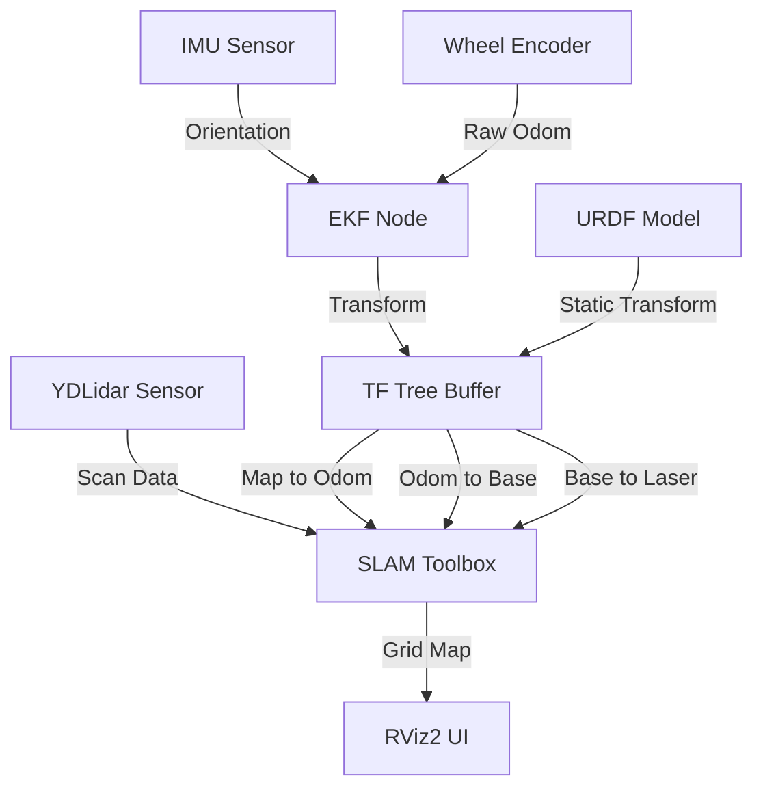

# Wildbot SLAM Toolbox 整合與實作指南

## 1. 專案概述 (Overview)
本實作目標是在 **Wildbot** 機器人平台上整合 ROS 2 SLAM Toolbox，實現即時 2D 柵格地圖（Occupancy Grid）建圖功能。透過修復 TF 座標鏈的完整性與容器化生命週期管理，解決了感測器數據無法轉換與服務自動化部署的痛點。

## 2. 技術棧與環境 (Tech Stack)
- **核心架構**: ROS 2 Jazzy (Dockerized)
- **作業系統**: Ubuntu 24.04 (Linux)
- **硬體驅動**: YDLIDAR 4ROS (TG30), Handsfree IMU (A9)
- **核心套件**: 
    - `slam_toolbox`: 非同步建圖模式 (Online Async)
    - `robot_localization`: EKF 擴展卡爾曼濾波器 (融合 Odom 與 IMU)
    - `robot_state_publisher`: URDF 模型廣播

## 3. 系統架構流程圖 (Architecture)
以下展示了數據從感測器流向地圖生成的邏輯鏈條：



> **連線說明**:
> - Scan Data: 原始雷達掃描數據
> - Orientation: 慣性測量姿態
> - Raw Odom: 輪式里程計數據
> - Map to Odom: SLAM 修復的定位漂移
> - Odom to Base: EKF 融合後的里程計坐標
> - Base to Laser: 雷達相對於機器人中心的靜態位置

## 4. 核心邏輯與實作 (Core Implementation)

### A. 持久化 URDF 座標修正
在 `kros_car_persistent.xacro` 中手動加入雷達坐標系，並透過 Docker Volume 掛載回容器，確保 `laser` 座標永遠存在。

```xml
<!-- 關鍵片段: 定義雷達位置 -->
<link name="laser"/>
<joint name="laser_joint" type="fixed">
    <parent link="base_link"/>
    <child link="laser"/>
    <!-- XYZ 分別代表前後、左右、高度 -->
    <origin xyz="0.1 0 0.15" rpy="0 0 0"/>
</joint>
```

### B. SLAM 生命週期管理 (Launch File)
針對 ROS 2 Jazzy 的 `LifecycleNode` 特性，使用官方提供的管理機制確保節點啟動後自動進入「激活 (Activate)」狀態。

```python
# wildbot_slam/launch/slam_launch.py
import os
from ament_index_python.packages import get_package_share_directory
from launch import LaunchDescription
from launch.actions import IncludeLaunchDescription
from launch.launch_description_sources import PythonLaunchDescriptionSource

def generate_launch_description():
    pkg_share = get_package_share_directory('wildbot_slam')
    slam_config = os.path.join(pkg_share, 'config', 'mapper_params_online_async.yaml')
    
    # 引用官方 online_async_launch 以自動處理 Configure 與 Activate
    return LaunchDescription([
        IncludeLaunchDescription(
            PythonLaunchDescriptionSource(
                os.path.join(get_package_share_directory('slam_toolbox'), 'launch', 'online_async_launch.py')
            ),
            launch_arguments={
                'slam_params_file': slam_config,
                'use_sim_time': 'false'
            }.items()
        )
    ])
```

### C. Docker Compose 自動化部署
將 SLAM 服務納入現有的全機啟動網路，確保容器間可以互相發現主題。

```yaml
# docker-compose_slam.yml
services:
  slam_toolbox:
    image: wildbot_workspace:latest
    volumes:
      - /home/robot/wildbot_real car/wildbot_workspace-main:/workspaces
    networks:
      - compose_my_bridge_network
    command: >
      bash -c "source /workspaces/install/setup.bash && ros2 launch wildbot_slam slam_launch.py"
```

## 5. 執行與操作步驟 (How to Run)

1. **啟動全機服務 (不含 SLAM)**:
   在宿主機終端機執行腳本，這會啟動底盤、相機與雷達：
   ```bash
   sudo ./scripts/00_start_all.sh
   ```

2. **手動開啟 SLAM 建圖**:
   進入容器後，直接執行我們預設好的快捷腳本：
   ```bash
   docker exec -it compose-kros_car-1 bash
   # 進入容器後輸入
   ./slam.sh
   ```

3. **開始建圖**:
   - 使用遙控手把緩慢移動機器人。
   - 觀察 `/map` 的 `width` 與 `height` 是否隨著移動而變大。

## 6. 已知問題與後續擴充 (Next Steps)
- **雷達校驗錯誤 (Checksum Error)**: YDLIDAR 在高頻運行下偶發校驗失敗，建議檢查 USB 供電（使用 Y 型線補電）。
- **地圖持久化**: 目前尚未實作自動存檔功能。未來可調用 `slam_toolbox` 的 `save_map` 服務將地圖儲存為 `.yaml` 檔。
- **導航整合 (Nav2)**: 下一階段可將產出的 `/map` 直接對接至 Navigation2 框架，實現自主路徑規劃。
