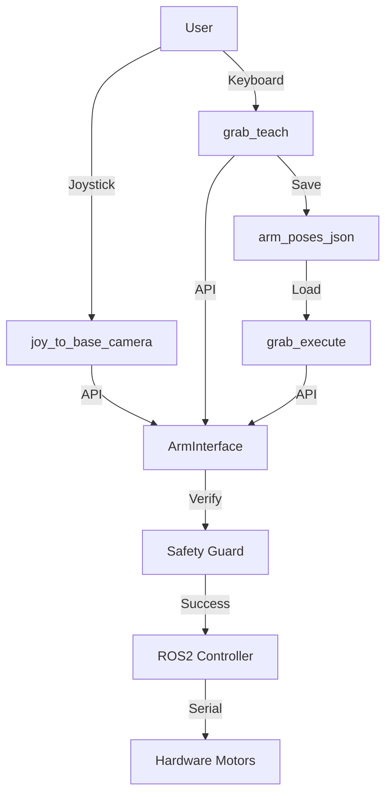

# 🤖 Wildbot 手臂教導與自動化執行系統技術筆記

## 1. 專案概述 (Overview)
本實作旨在為 Wildbot 機器人建立一套高效、安全的手動教導 (Teaching) 與自動回放 (Playback) 系統。透過封裝統一的 `ArmInterface` 核心，解決了多套控制腳本邏輯不一致、移動卡頓、以及容易撞擊地面的安全性痛點，實現了「手把移動、按鍵紀錄、指令執行」的完整工作流。

## 2. 技術棧與環境 (Tech Stack)
- **核心框架**: ROS 2 Jazzy (Ubuntu 24.04 Docker Container)
- **程式語言**: Python 3.12+
- **通訊協議**: 
    - **QoS**: Sensor Data (Best Effort) 模式，確保高頻狀態同步穩定。
    - **Action**: FollowJointTrajectory 用於精確平滑的軌跡控制。
- **資料格式**: JSON (用於點位持久化儲存)。
- **物理計算**: 正向運動學 (Forward Kinematics) 實時位置校驗。

## 3. 系統架構流程圖 (Architecture)



## 4. 核心邏輯與程式碼 (Core Implementation)

### A. 統一控制接口：`arm_interface.py`
這是全系統的靈魂，負責處理所有與硬體通訊的細節，並強制執行安全限制。它被符號連結 (Symlink) 到各個工作目錄，確保邏輯絕對同步。在此版本中，我們捨棄了容易因物理測量誤差導致失效的高度計算，改用更穩定、直接的**兩軸弧度總合**進行攔截。

### B. 教導錄製器：`grab_teach.py`
提供實時座標顯示，並支援「紀錄模式」與「回放模式」切換。

```python
# 按下數字鍵 0-9 紀錄目前點位至 JSON
def save_pose(self, slot):
    pos = list(self.arm.current_positions)
    self.saved_poses[str(slot)] = pos
    with open(self.pose_file, 'w') as f:
        json.dump(self.saved_poses, f, indent=4)
    # 同步計算並印出 X, Z 座標
    x_m, z_m = self.arm.get_coordinates(pos[0], pos[1])
    print(f"✅ 已紀錄點位 {slot} (X: {x_m*100:.1f} cm, Z: {z_m*100:.1f} cm)")
```

### C. 自動化執行器：`grab_execute.py`
輕量化的指令列工具，支援單點移動或複雜的動作序列。

```python
# 使用範例：python3 grab_execute.py 1 2 1
for slot in sys.argv[1:]:
    node.move_to_slot(slot) # 自動移動並等待抵達
```

## 5. 執行與操作步驟 (How to Run)

### 第一步：環境進入與路徑準備
```bash
# 進入 Wildbot 主容器
sudo ./launch_shell.sh
# 進入教導腳本目錄
cd /workspaces/workspaces/src/arm_ik/arm_ik/
```

### 第二步：開始採集點位
1. 確保手把控制節點已啟動。
2. 執行 `python3 grab_teach.py`。
3. 用手把將手臂移到目標位置，按鍵盤 `0-9` 存檔。
4. 按鍵盤 `R` 可切換至回放模式測試該點位是否正確。

### 第三步：執行自動化任務
採集完畢後，直接執行指令讓機器人動作：
```bash
# 移動到 1 號點
python3 grab_execute.py 1
# 執行一套循環動作 (1 -> 2 -> 1)
python3 grab_execute.py 1 2 1
```

## 6. 已知問題與後續擴充 (Next Steps)
- **動態避障**: 目前採用靜態的弧度限位保護桌面，未來可加入與 LiDAR 點雲聯動的動態環境偵測。
- **軌跡插值**: 目前移動採用直達式控制，若點位距離過遠，建議在 `grab_execute` 中加入中間過渡點以平滑路徑。
- **夾爪力矩監控**: 目前僅有角度保護，未來可結合馬達電流讀值實作「力覺反饋」抓取，防止過度擠壓目標物。
