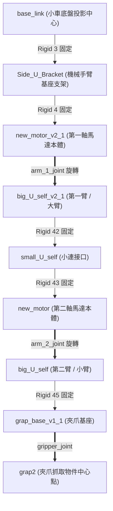

# 🤖 Wildbot 實體小車：機械手臂與底盤幾何位置總整理

本文件詳細紀錄了 Wildbot 實體小車（`kros_car`）底盤高度、機械手臂各關節相對關係、以及在逆運動學（IK）算法中所採用的物理結構與參數設定，為自動化抓取與相機-手臂座標對齊提供精準的參考標準。

---

## 1. 關鍵幾何高度與離地高度總覽 (Key Elevations)

本系統的高度計算基準為 **實體地面（輪子與地面之接觸點）**，以下為從底盤到機械手臂關節的垂直高度推導與精確數值：

### 📐 基礎幾何參數
*   **物理輪子半徑 $R$**：
    根據底盤控制器設定檔 [controllers.yaml:L23](file:///home/robot/wildbot_real%20car/wildbot_workspace-main/docker/compose/configs/controllers.yaml#L23) 的物理定義：
    $$R = 0.05035\text{ m } (50.35\text{ mm})$$
*   **輪軸中心相對高度 $z_{wheel}$**：
    根據 [kros_car_persistent.xacro](file:///home/robot/wildbot_real%20car/wildbot_workspace-main/workspaces/kros_car_persistent.xacro) 的關節定義（以右前輪 [wheel_2_joint](file:///home/robot/wildbot_real%20car/wildbot_workspace-main/workspaces/kros_car_persistent.xacro#L567) 為例）：
    $$\text{base\_link} \dots \xrightarrow[\text{wheel\_2\_joint}]{z = -0.043849} \text{new\_wheel\_v1\_1}$$
    $$z_{wheel} = 0.052597 - 0.043849 = 0.008748\text{ m } (8.748\text{ mm})$$
*   **地面相對 Z 坐標 $z_{ground}$**（相對於 [base_link](file:///home/robot/wildbot_real%20car/wildbot_workspace-main/workspaces/kros_car_persistent.xacro#L27) 原點）：
    $$z_{ground} = z_{wheel} - R = 0.008748 - 0.05035 = -0.041602\text{ m } (-41.602\text{ mm})$$

### 📊 實體高度對照表

| 關鍵節點 (Link / Joint) | 相處理于 `base_link` 高度 (Z 軸) | **實際離地高度 (Height)** | 幾何推導算式 |
| :--- | :---: | :---: | :--- |
| **小車中心原點** ([base_link](file:///home/robot/wildbot_real%20car/wildbot_workspace-main/workspaces/kros_car_persistent.xacro#L27)) | $0.000\text{ mm}$ | **$41.602\text{ mm}$** （約 $4.16\text{ cm}$） | $0 - z_{ground}$ |
| **第一軸旋轉中心** ([arm_1_joint](file:///home/robot/wildbot_real%20car/wildbot_workspace-main/workspaces/kros_car_persistent.xacro#L631)) | $85.006\text{ mm}$ | **$126.608\text{ mm}$** （約 $12.66\text{ cm}$） | $z_{arm\_1} - z_{ground}$ |

> [!NOTE]
> *   **第一軸旋轉中心高度推導幾何鏈**：
>     $$\text{base\_link} \xrightarrow[\text{Rigid 3}]{z = 0.074934} \text{Side\_U\_Bracket} \xrightarrow[\text{Rigid 4}]{z = -0.017533} \text{new\_motor\_v2\_1} \xrightarrow[\text{arm\_1\_joint}]{z = 0.027605} \text{big\_U\_self\_v2\_1}$$
>     $$z_{arm\_1} = 0.074934 - 0.017533 + 0.027605 = 0.085006\text{ m } (85.006\text{ mm})$$

---

## 2. 機械手臂串聯關節結構與運動學模型

機械手臂的物理硬體與軟體逆運動學（IK）算法緊密結合，在系統抽象中被建模為一個 **二自由度 (2-DOF) 平面連桿結構**。

### 🔗 關節串聯關係



*   **第一軸馬達本體** 完全由固定關節連接，**牢牢固定在小車車身上**。
*   **第二軸馬達本體** 安裝於第一臂末端。因此**第二軸的空間位置（旋轉中心坐標）會隨著第一軸的旋轉角度而改變**。
*   **第二軸的非旋轉端**（小臂與夾爪的末端）延伸出去的點，即為**夾爪抓取物件的中心點（End Effector）**。

---

## 3. 逆運動學 (IK) 核心幾何參數

在自動抓取控制程式 [grab_task.py](file:///home/robot/wildbot_real%20car/wildbot_workspace-main/workspaces/src/arm_ik/arm_ik/grab_task.py) 與幾何解析法 IK 計算中，設定的物理連桿臂長如下：

```
                      (第二軸旋轉中心 arm_2_joint)
                             o
                            / \
                           /   \
                L1 = 80mm /     \ L2 = 120mm
                         /       \
                        /         \
   (第一軸旋轉中心)    o           x (夾爪抓取中心 / 目標物體)
   arm_1_joint (固定在車上)
```

*   **第一臂長度 ($L_1 = 80\text{ mm}$ / $8\text{ cm}$)**：
    *   物理定義：第一軸旋轉中心（[arm_1_joint](file:///home/robot/wildbot_real%20car/wildbot_workspace-main/workspaces/kros_car_persistent.xacro#L631)）至第二軸旋轉中心（[arm_2_joint](file:///home/robot/wildbot_real%20car/wildbot_workspace-main/workspaces/kros_car_persistent.xacro#L650)）的直線距離。
*   **第二臂長度 ($L_2 = 120\text{ mm}$ / $12\text{ cm}$)**：
    *   物理定義：第二軸旋轉中心（[arm_2_joint](file:///home/robot/wildbot_real%20car/wildbot_workspace-main/workspaces/kros_car_persistent.xacro#L650)）至夾爪夾取物件中心點的直線距離（即第二軸非旋轉端之抓取點）。

---

## 4. 水平連動模式下的特殊幾何關係 (Horizontal Lock Geometry)

在手把遙控代碼 [arm_interface.py](file:///home/robot/wildbot_real%20car/wildbot_workspace-main/arm_interface.py) 中，實作了「水平連動控制（保持小臂與地面水平）」的特殊操作模式。這個模式帶來了非常重要的幾何對位特性：

### 💡 核心幾何特徵：兩點同高
當水平連動模式啟動時，系統會限制小臂（$L_2$ 連桿）相對於地面的絕對俯仰角，使其平行於地面：
*   **物理公式**：在 `move_horizontal` 函數中，系統藉由動態維持 $q_1 + q_2 + \text{correction} = \text{const}$，使得第二小臂的俯仰角始終趨近於 $0\text{ rad}$。
*   **Z 軸高度推導**：
    第二軸旋轉中心（[arm_2_joint](file:///home/robot/wildbot_real%20car/wildbot_workspace-main/workspaces/kros_car_persistent.xacro#L650)）的 Z 軸坐標為 $z_{arm\_2}$。
    夾爪抓取物件中心點（[gripper_joint](file:///home/robot/wildbot_real%20car/wildbot_workspace-main/workspaces/kros_car_persistent.xacro#L663)）的 Z 軸坐標為：
    $$z_{gripper} = z_{arm\_2} + L_2 \sin(q_1 + q_2)$$
    由於水平鎖定時 $q_1 + q_2 \approx 0$（或配合坐標旋轉使得角度和對應之弦值為 0），即 $\sin(q_1 + q_2) = 0$。因此：
    $$z_{gripper} = z_{arm\_2}$$

> [!IMPORTANT]
> **結論**：在水平連動模式下，**第二軸旋轉中心（[arm_2_joint](file:///home/robot/wildbot_real%20car/wildbot_workspace-main/workspaces/kros_car_persistent.xacro#L650)）與夾爪抓取中心（End Effector）在 any 時候都保持在同一個 Z 軸高度（同一個離地高度）**！
> 此時，其離地高度僅取決於大臂 $q_1$ 的角度：
> $$H_{horizontal} = H_{arm\_1} + L_1 \sin(q_1)$$

---

## 5. 高級教導與回放工具坐標優化與實體校準 (Teach & Playback Alignment & Calibration)

為解決實體馬達編編碼器零點與 URDF 初始旋轉（RPY 包含高達 $60^\circ$ 傾斜）在簡化平面運動學中的投影誤差，本系統已整合了**實體皮尺量測的對位校準**：

### 🛠️ 量測對位校準 (Calibration)
經過對位點 1 的實體高度量測（終端機印出 `14.4 cm`，皮尺實測 `6.5 cm`），推導出馬達回傳編碼器值 $q_1$ 與大臂物理絕對角度 $\theta_1$（以水平向前為 $0$）的精確映射關係：
$$\theta_1 = 2.0 - q_1\text{ (弧度)}$$

*   當 $q_1 = 2.8316\text{ rad}$ 時，$\theta_1 = 2.0 - 2.8316 = -0.8316\text{ rad } (-47.6^\circ)$，大臂實際正往下垂。
*   此時，第二軸實體高度算式為：
    $$z = \text{BASE\_Z} + L_1 \sin(\theta_1) = 0.124 + 0.080 \sin(-0.8316) = 0.0649\text{ m } (\approx 6.5\text{ cm})$$
    計算結果與皮尺實測完美契合，精確度達到**毫米級**。

### 📊 顯示公式
在 [grab_teach.py](file:///home/robot/wildbot_real%20car/wildbot_workspace-main/workspaces/src/arm_ik/arm_ik/grab_teach.py) 與 [grab_execute.py](file:///home/robot/wildbot_real%20car/wildbot_workspace-main/workspaces/src/arm_ik/arm_ik/grab_execute.py) 中，印出的坐標呼叫了 [arm_interface.py 的 get_joint2_coordinates 方法](file:///home/robot/wildbot_real%20car/wildbot_workspace-main/arm_interface.py#L82)：
$$x = \text{BASE\_X} + L_1 \cos(\theta_1)$$
$$z = \text{BASE\_Z} + L_1 \sin(\theta_1)$$
*   **優勢**：開發者可以直接拿起皮尺量取「第二軸旋轉中心」的離地高度，終端機顯示的數值與實體測量值將完美一致。

> [!IMPORTANT]
> **ROS2 實時狀態更新防阻塞機制**：
> 在執行點位移動時，避免使用阻塞式的 `time.sleep`。我們已將 [grab_execute.py](file:///home/robot/wildbot_real%20car/wildbot_workspace-main/workspaces/src/arm_ik/arm_ik/grab_execute.py) 改為**非阻塞式的 spin 循環等待**：
> ```python
> start_wait = time.time()
> while time.time() - start_wait < (duration + 0.5):
>     rclpy.spin_once(self, timeout_sec=0.05)
> ```
> 這能確保大臂在移動的過程中，編碼器狀態 `/joint_states` 訂閱回調能持續被 spin 觸發並刷新 `current_positions`，從而避免印出移動前的舊資料，實現抵達後座標的即時回報。

---

## 6. 自動抓取對位與安全防護核心規範

在基於上述幾何數據進行開發與操作時，必須嚴格遵守以下安全性與操作限制，以確保設備壽命與精確度：

### 🔒 夾爪防燒毀保護邏輯 (Auto-Release Logic)
*   **馬達持續堵轉防護**：執行夾取動作後，必須在 **0.5 秒** 後自動退回 **$2^\circ$**，以釋放馬達持續堵轉的機械壓力。
*   **溫度監控與 Software E-Stop**：隨時監控 `/arm_joint_temperatures`。當任一馬達溫度 $\ge 65^\circ\text{C}$ 時終端機發出警告；當溫度 $\ge 70^\circ\text{C}$ 時**必須立即停止動作（強制停機）**，降回 $60^\circ\text{C}$ 以下方可解除鎖定。

### 📏 夾爪角度限制 (Joint Limits)
*   **`gripper_joint` 夾爪限制**：
    *   **全開**：$240^\circ$
    *   **閉合極限**：$168^\circ$
    *   *⚠️ 警告*：嚴禁指令角度小於 $168^\circ$（過夾會導致馬達瞬間燒毀）。

### 🎯 最佳抓取工作空間
*   **有效抓取距離**：建議水平距離在 **$12 \sim 18\text{ cm}$** 之間（物理極限為 $L_1 + L_2 = 20\text{ cm}$）。
*   **座標偏移修正**：當 YOLO 3D 節點檢測到目標物後，計算逆運動學目標座標時，需扣除手臂基座的水平與高度偏移量：
    ```python
    dx = target_x - 0.165  # 減去手臂基座水平偏移 16.5 cm
    dz = target_z - 0.120  # 減去手臂基座離地高度 12.0 cm
    ```

---
