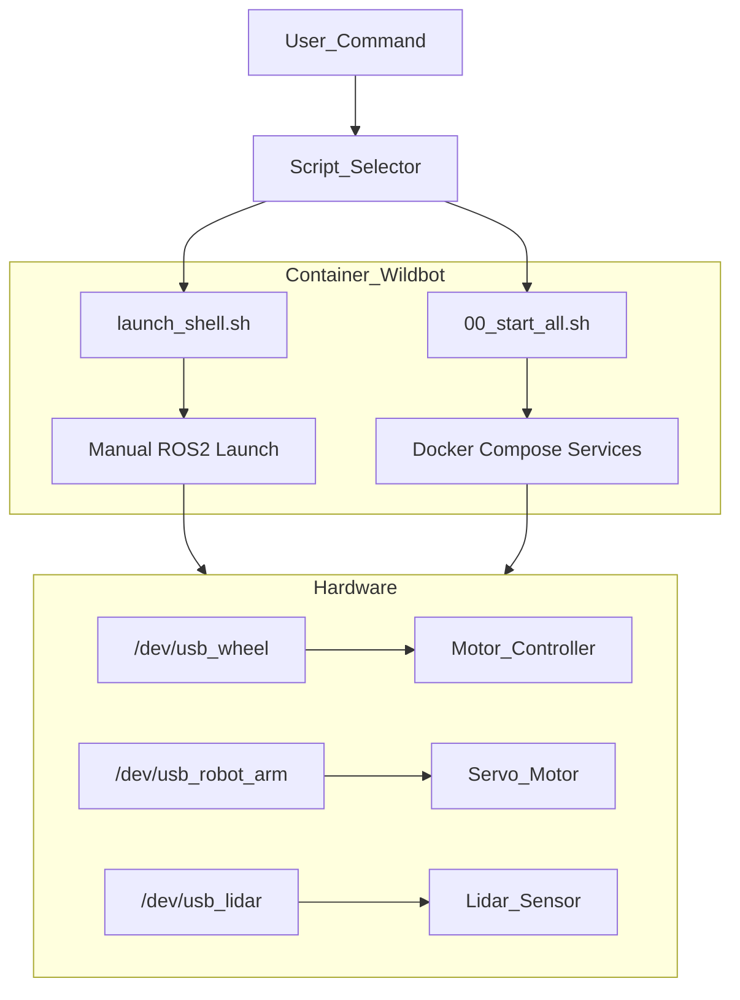

## 🤖 Wildbot 實體小車開發與操作核心準則

使用 ros2 jazzy 版本

### 1. 硬體設備映射規則 (USB Device Mapping)

在撰寫任何涉及硬體通訊（如 ROS2 Node 設定、Serial 通訊）的程式碼時，必須優先使用 **Symlink** 而非原始設備路徑，以確保設備重啟後的一致性。

| **設備名稱 (Symlink)** | **實際序列埠 (Device)** | **用途描述** | **備註標記** |
| --- | --- | --- | --- |
| `/dev/usb_wheel` | `/dev/ttyACM1` | 底盤電機控制器 | oradar |
| `/dev/usb_robot_arm` | `/dev/ttyUSB0` | 機械手臂伺服馬達 | - |
| `/dev/usb_lidar` | `/dev/ttyUSB1` | LiDAR 光學雷達 | ydlidar, imu_a9 |

---

### 2. 機械手臂安全防護規範 (Safety Constraints)

在撰寫機械手臂控制邏輯或 MoveIt 軌跡規劃時，**必須** 嵌入以下限制，違反規律可能導致硬體損毀或馬達燒毀。

### **角度限制 (Joint Limits)**

- **`arm_1_joint`**: $30^\circ \sim 210^\circ$（需檢查是否會碰撞地板）。
- **`arm_2_joint`**: $0^\circ \sim 240^\circ$（需檢查是否會碰撞地板）。
- **`gripper_joint` (夾爪)**:
    - **全開**: $240^\circ$
    - **閉合極限**: $168^\circ$
    - **警告**: 嚴禁指令角度小於 $168^\circ$，否則會發生「過夾 (Over-clamping)」導致馬達燒毀。

### **保護邏輯 (Auto-Release Logic)**

- **防燒毀機制**: 執行夾取動作後，必須在 **0.5 秒** 後自動退回 **$2^\circ$**，以釋放馬達持續堵轉的壓力。

---

### 3. 系統運行與除錯工作流

AI 提供的腳本或操作指令必須區分「開發環境」與「正式部署」兩大場景。

### **開發與調試 (Development & Debug)**

- **指令**: `sudo ./launch_shell.sh`
- **行為**: 啟動並進入 `wildbot` 主容器終端機 (bash)。
- **情境**: 編譯程式碼 (`colcon build`)、測試新驅動、手動執行單一 ROS2 Node。
- **路徑**: `/home/robot/wildbot_real car/wildbot_workspace-main`

### **正式全機運行 (Production/Deployment)**

- **指令**: `sudo ./scripts/00_start_all.sh`
- **行為**: 透過 `docker-compose` 背景啟動所有服務（底盤、相機、雷達、Bridge）。
- **進入運行中容器**: `docker exec -it compose-kros_car-1 bash`
- **情境**: 執行正式任務、機器人自主移動。

---

### 4. 系統架構圖 (Mermaid for Notion)

在協助規劃邏輯時，請參考以下架構，注意標籤不使用括號與特殊字元。

---

### 5. AI 回答原則

- **簡約優先**: 除非使用者要求「詳細」，否則代碼與建議以簡單、直接、易於維護為最高準則。
- **繁體中文**: 所有回覆與註解需使用繁體中文。
- **事實查核**: 針對法規、特定庫 (Library) 版本或硬體規範，僅依據確切已知事實回答。若信心不足，請標註「【資料不足，無法確認】」。
- **不確定的資訊**: 若無法確認硬體狀態或參數是否正確，請直接回答「不知道」。

---

### 1. 機器人控制 (Robot Control)

- **手臂控制 (`/arm_controller`)**:
- `/arm_controller/controller_state`: 手臂控制器的當前狀態。
- `/arm_controller/joint_trajectory`: 手臂關節控制的路徑/軌跡。
- `/arm_controller/transition_event`: 控制器狀態切換事件。
- **底盤控制 (`/base_controller`)**:
- `/base_controller/cmd_vel`: 控制底盤移動的速度指令（Linear/Angular）。
- `/base_controller/odom`: 底盤的里程計數據（位置與速度估計）。
- `/base_controller/transition_event`: 底盤控制器狀態切換事件。
- **控制器管理 (`/controller_manager`)**: 包含 `activity`、`introspection_data` (名稱/數值) 與 `statistics` (全量/名稱/數值)，用於監控所有硬體控制器的運行狀況。

### 2. 相機感測器 (Camera Sensors)

- **彩色影像 (`/camera/color`)**: 包含原始影像 (`image_raw`)、相機參數 (`camera_info`)，以及多種壓縮格式（Compressed, CompressedDepth, Theora, Zstd）。
- **深度影像 (`/camera/depth`)**: 包含深度圖、點雲數據 (`points`) 以及對應的壓縮格式與參數。
- **紅外線影像 (`/camera/ir`)**: 紅外線原始影像與相關參數。
- **對齊與過濾**:
- `/camera/depth_to_color` / `/camera/depth_to_ir`: 深度圖與其他影像的對齊資訊。
- `/camera/depth_filter_status`: 深度濾波器的運行狀態。

### 3. 其他感測器數據 (Other Sensors)

- **雷達掃描 (`/scan`, `/scan_tmp`)**: 2D 激光雷達 (LiDAR) 的掃描數據。
- **慣性測量 (`/imu/data`)**: 機器人的姿勢、加速度與角速度資訊。
- **溫度監控 (`/arm_joint_temperatures`)**: 手臂各個關節的實時溫度。

### 4. 機器人狀態與變換 (State & Transforms)

- `/joint_states`: 所有關節的當前位置、速度與力矩資訊。
- `/dynamic_joint_states`: 動態關節狀態。
- `/tf` 與 `/tf_static`: 座標系變換資訊（動態即時變換與靜態結構變換）。
- `/robot_description`: 機器人的模型描述（通常是 URDF 內容）。
- `/joint_state_broadcaster/transition_event`: 關節狀態廣播器的事件監控。

### 5. 導航與人機互動 (Navigation & Interaction)

- `/move_base_simple/goal`: 發送給導航系統的目標點。
- `/initialpose`: 設定機器人的初始估計位姿（常用於 AMCL 定位初始化）。
- `/clicked_point`: 在 Rviz 中點擊的座標點。
- `/joy` 與 `/joy/set_feedback`: 遊戲手把 (Joystick) 的輸入訊號與回饋設定。

### 6. 系統監測與通訊 (System & Communication)

- `/rosout`: 系統日誌訊息。
- `/parameter_events`: 節點參數修改的事件通知。
- `/diagnostics`: 硬體與軟體的診斷報告。
- `/client_count` 與 `/connected_clients`: 目前系統連線的客戶端數量與明細。
- `/out`: 包含各種壓縮格式的輸出數據流。

---

🤖 Wildbot 競賽規則彙整

這份競賽規章主要分為硬軟體規範、初賽賽制與決賽賽制三大核心，以下為您整理的重點資訊：

一、 硬體與操作限制 (核心規範)

底盤保護：禁止對官方原始底盤進行任何切割或結構修改。

功能擴充：允許增加感測器、攝影機、機械臂等組件，但賽後須恢復原狀歸還。

自主運行：啟動後嚴禁任何遠端連線（如 SSH、藍牙或 Wi-Fi 控制）。

重啟機制：每場有 3 次重啟機會，重啟須等待 15 秒且移回起點。

二、 初賽：12 分鐘對決 (取前 10 名)

初賽目標是累積總分，爭取進入排行榜前 10 名。

階段任務內容時間備註第一階段A、B 兩隊同時抓取物件8 分鐘需避免車身碰撞第二階段A 隊執行過橋任務2 分鐘B 隊需撤出場外第三階段B 隊執行過橋任務2 分鐘A 隊需撤出場外初賽計分與決勝準則

加分：抓取並舉起物件 (+5)、運回起點 (+5)、上橋走到位 (+5)、下橋回起點 (+5)。

扣分：碰撞靜態障礙 (-1/次)、物件掉落 (-1/次)。

失格：擦撞對手車身直接取消資格 (DQ)。

平手遞補順序：1. 放回物件總數 $\rightarrow$ 2. 最後物件完成時間 $\rightarrow$ 3. 過橋任務完成時間。

三、 決賽：15 分鐘對決 (總合評分)

決賽成績由 實體競賽 (70%) 與 口頭報告 (30%) 組成。

階段任務內容時間第一階段A、B 兩隊同時抓取物件10 分鐘第二階段A 隊：上橋取物 / B 隊：開門任務2.5 分鐘第三階段B 隊：上橋取物 / A 隊：開門任務2.5 分鐘決賽特有任務得分

上橋取物：駛上橋中點 (+5)、取得橋上物件 (+5)、運回起點 (+5)。

開門任務：解鎖門把 (+5)、推開至規定角度 (+5)。

平手遞補順序：優先比較「放回物件總數」，最後才比較「口頭報告得分」。

四、 競賽流程示意圖

graph TD

    Start[競賽開始] --> Phase1[第一階段 同時抓取物件]

    Phase1 --> Choice{賽制類型}

    

    Choice -- 初賽 --> PreBridge[過橋任務 輪流執行]

    PreBridge --> Ranking1[計算總分 前10名晉級]

    

    Choice -- 決賽 --> FinalTask[上橋取物 與 開門任務 輪流交換]

    FinalTask --> ScoreFinal[競賽積分70% + 簡報評分30%]

    ScoreFinal --> Winner[判定最終名次]

    

    subgraph Warning[違規警告]

    DQ[碰撞對手車身] --- Cancel[取消資格]

    end

實體小車描述

一、 kros_car 系統功能描述

這台 kros_car 是一台整合了「移動」與「操作」能力的自主移動機器人 (AMR)，具體功能如下：

全向/差速移動能力 (底盤)配備四輪獨立驅動，透過 /dev/usb_wheel 接收速度指令。

能執行室內環境巡航，為建立 2D 語義地圖與混合式 SLAM 系統（例如 SCAN-IT）提供穩定的移動載具。

物件抓取與操作 (機械臂與夾爪)配備兩軸機械臂與一組對稱式夾爪，透過 /dev/usb_robot_arm 控制精確位置。

夾爪具備完善的安全機制（500ms 堵轉偵測、自動退回保護、70°C 過熱防護），能夠安全地執行目標物搜尋後的抓取任務。

平面感知與避障 (2D LiDAR)車頭配置的光達 (laser) 可掃描周遭平面輪廓，用於建圖與即時避障。

3D 視覺與目標檢測 (深度相機)【此為新增硬體延伸功能】：加入深度相機後，機器人的感知層將具備 3D 視覺能力，能夠擷取 RGB 影像與深度資訊。這非常適合串接 YOLO 節點進行影像辨識與目標檢測，進而實現開放詞彙 (Open-Vocabulary) 的語義導航任務。

更新後的系統架構圖

加入光達與深度相機後，整台車的固定層級關係如下：

graph TD

    Base[base_link 機身主體] -->|Fixed joint| UpperBlue[upper_blue_v1_1 上層藍色結構]

    Base -->|Fixed joint| UpperSilver[upper_silver_v1_1 上層銀色結構]

    Base -->|Continuous joint| Wheels[四個輪組系統]

    Base -->|Fixed joint| ArmBase[Side_U_Bracket 機械臂基座]

    ArmBase -->|Continuous joints| Arm[兩軸機械臂與夾爪]

    Base -->|Fixed joint| Lidar[laser 2D光達]

    Base -->|Fixed joint| DepthCamera[camera_link 深度相機]

## 小車自由度 (Degrees of Freedom) 

1. 位形空間（Configuration Space）：車子最終可以到達平面上的任何位置 $(x, y)$，並且擁有任意的朝向角度 $(\theta)$，因此它具備 3 個控制維度。

2.速度空間（Velocity Space）：但在任意給定的瞬間，你只能控制兩個變數——前進/後退的速度 ($v$) 加上 前輪轉向的角度 ($\phi$ 或角速度 $\omega$)，也就是只有 2 個自由度。

## 電腦設備規格

### ASUS ExpertCenter PN54 (Ryzen AI 7 350)

### 1. 處理器與核心架構 (CPU)

- **型號與微架構**：搭載 AMD Ryzen™ AI 7 350 處理器。這是 AMD 於 2025 年發布的 Krackan Point 系列，採用台積電 4 奈米先進製程，核心架構結合了高效能的 **Zen 5** 與高能效的 **Zen 5c**。
- **效能調度**：支援動態熱設計功耗 (TDP) 調整（涵蓋 15W 至 54W 區間）。這意味著設備能在低負載時極度省電，但在進行多工運算或資料庫處理時，又能瞬間釋放高達 5.0 GHz 的加速時脈，確保「純粹效能」不被輕薄機身所限制。

### 2. 次世代 AI 加速單元 (NPU)

- **硬體規格**：內建 AMD 第三代 XDNA™ 2 架構的神經處理單元 (NPU)。
- **50 TOPS 算力**：TOPS 代表「每秒兆次運算」。這顆 NPU 獨立提供高達 50 TOPS 的 INT8 運算能力，遠超微軟 Copilot+ PC 規定的 40 TOPS 門檻（較前代 Ryzen 8000 系列的 16 TOPS 提升數倍）。
- **實際應用**：它能將背景模糊、眼神接觸校正、語音降噪，甚至是本地端小型語言模型 (SLM) 或生成式 AI 的運算負載從 CPU/GPU 卸載。不僅系統反應更快，長時間運作下的發熱量也大幅降低。

### 3. 沉浸式視覺與圖形處理 (GPU)

- **顯示核心**：整合 AMD Radeon™ 800M 系列（通常為 Radeon 860M）顯示晶片，基於 RDNA 3.5 架構，帶來比前代更高的圖形吞吐量。

---

# Wildbot 系統目錄與 Docker 掛載結構指南

為了確保系統穩定，所有 Docker Compose 服務已統一掛載規則。

## 1. 核心路徑定義 (Path Definitions)

*   **主機根目錄**: `/home/robot/wildbot_real car/wildbot_workspace-main`
*   **容器內根目錄**: `/workspaces`
*   **編譯產物路徑**: `/workspaces/install/setup.bash` (這是所有服務的核心依賴)

## 2. 各服務掛載與啟動清單 (Service Inventory)

| 服務名稱 (Service) | Compose 檔案 | 掛載路徑 (Host -> Container) | 啟動指令 (Source Path) |
| :--- | :--- | :--- | :--- |
| **底盤/手臂** | `kros_car.yml` | `.../wildbot_workspace-main:/workspaces` | `/workspaces/install/setup.bash` |
| **Rosbridge** | `rosbridge_server.yml` | `.../wildbot_workspace-main:/workspaces` | `/workspaces/install/setup.bash` |
| **LiDAR 驅動** | `ydlidar.yml` | `.../wildbot_workspace-main:/workspaces` | `/workspaces/install/setup.bash` |
| **IMU 驅動** | `kros_car.yml` | `.../wildbot_workspace-main:/workspaces` | `/workspaces/workspaces/imu_ws/install/setup.bash` |
| **手把控制** | `kros_car.yml` | `.../wildbot_workspace-main:/workspaces` | `/opt/ros/jazzy/setup.bash` |
| **YOLO (手動)** | `yolo.sh` | (繼承 kros_car 容器) | `/workspaces/workspaces/install/setup.bash` |

## 3. 重要注意事項 (Critical Rules)

1.  **路徑一致性**: 
    - 所有的 YAML 檔案中的 `volumes` 必須指向主機的 `wildbot_workspace-main` 目錄。
    - 內部指令必須先 `source /workspaces/install/setup.bash` 才能執行自定義功能。

2.  **YOLO 手動啟動**:
    - YOLO 已從 `docker-compose_kros_car.yml` 移除，改為手動啟動以節省資源。
    - 指令: `docker exec -it compose-kros_car-1 bash` -> `./yolo.sh`

3.  **Foxglove 連接**:
    - Rosbridge 必須掛載 `/workspaces` 才能讀取到 `yolo_msgs` 的訊息定義。
    - 如果 Foxglove 沒畫面，請先檢查 `docker logs compose-rosbridge-1` 是否有路徑錯誤。

4.  **IMU 特殊路徑**:
    - IMU 驅動位於獨立的工作空間，因此其 source 路徑為 `/workspaces/workspaces/imu_ws/install/setup.bash`。

