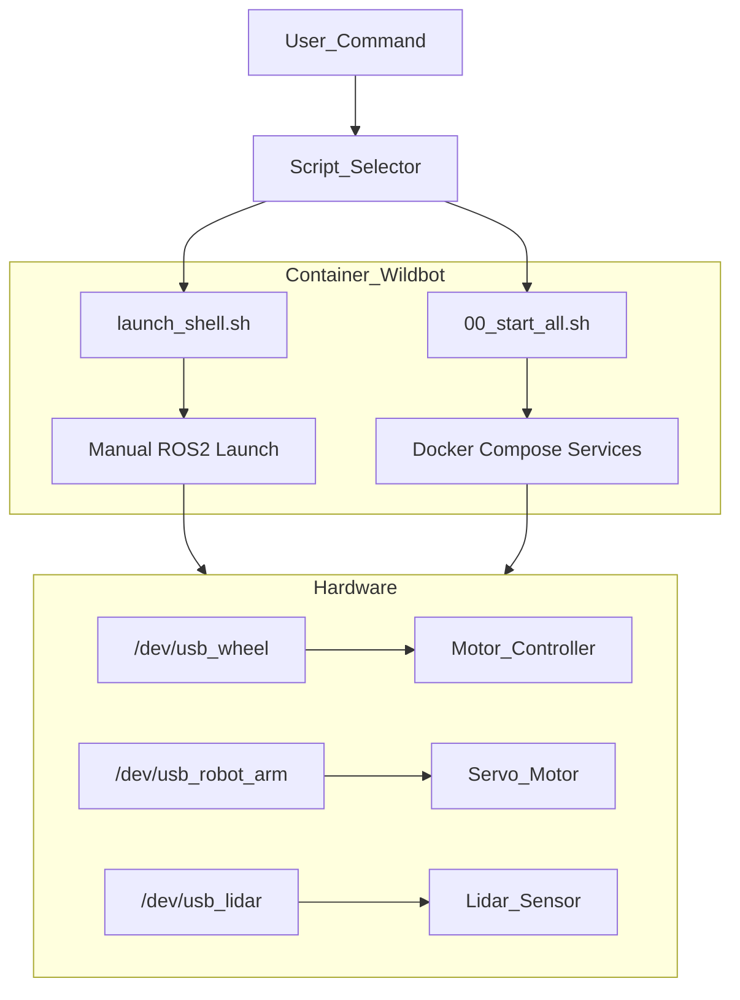

## 🤖 Wildbot 實體小車開發與操作核心準則

使用 ros2 jazzy 版本

### 1. 硬體設備映射規則 (USB Device Mapping)

在撰寫任何涉及硬體通訊（如 ROS2 Node 設定、Serial 通訊）的程式碼時，必須優先使用 **Symlink** 而非原始設備路徑，以確保設備重啟後的一致性。

| **設備名稱 (Symlink)** | **實際序列埠 (Device)** | **用途描述** | **備註標記** |
| --- | --- | --- | --- |
| `/dev/usb_wheel` | `/dev/ttyACM1` | 底盤電機控制器 | oradar |
| `/dev/usb_robot_arm` | `/dev/ttyUSB0` | 機械手臂伺服馬達 | - |
| `/dev/usb_lidar` | `/dev/ttyUSB1` | LiDAR 光學雷達 | ydlidar, imu_a9 |

---

### 2. 機械手臂安全防護規範 (Safety Constraints)

在撰寫機械手臂控制邏輯或 MoveIt 軌跡規劃時，**必須** 嵌入以下限制，違反規律可能導致硬體損毀或馬達燒毀。

### **角度限制 (Joint Limits)**

- **`arm_1_joint`**: $30^\circ \sim 210^\circ$（需檢查是否會碰撞地板）。
- **`arm_2_joint`**: $0^\circ \sim 240^\circ$（需檢查是否會碰撞地板）。
- **`gripper_joint` (夾爪)**:
    - **全開**: $240^\circ$
    - **閉合極限**: $168^\circ$
    - **警告**: 嚴禁指令角度小於 $168^\circ$，否則會發生「過夾 (Over-clamping)」導致馬達燒毀。

### **保護邏輯 (Auto-Release Logic)**

- **防燒毀機制**: 執行夾取動作後，必須在 **0.5 秒** 後自動退回 **$2^\circ$**，以釋放馬達持續堵轉的壓力。

---

### 3. 系統運行與除錯工作流

AI 提供的腳本或操作指令必須區分「開發環境」與「正式部署」兩大場景。

### **開發與調試 (Development & Debug)**

- **指令**: `sudo ./launch_shell.sh`
- **行為**: 啟動並進入 `wildbot` 主容器終端機 (bash)。
- **情境**: 編譯程式碼 (`colcon build`)、測試新驅動、手動執行單一 ROS2 Node。
- **路徑**: `/home/robot/wildbot_real car/wildbot_workspace-main`

### **正式全機運行 (Production/Deployment)**

- **指令**: `sudo ./scripts/00_start_all.sh`
- **行為**: 透過 `docker-compose` 背景啟動所有服務（底盤、相機、雷達、Bridge）。
- **進入運行中容器**: `docker exec -it compose-kros_car-1 bash`
- **情境**: 執行正式任務、機器人自主移動。

---

### 4. 系統架構圖 (Mermaid for Notion)

在協助規劃邏輯時，請參考以下架構，注意標籤不使用括號與特殊字元。

---

### 5. AI 回答原則

- **簡約優先**: 除非使用者要求「詳細」，否則代碼與建議以簡單、直接、易於維護為最高準則。
- **繁體中文**: 所有回覆與註解需使用繁體中文。
- **事實查核**: 針對法規、特定庫 (Library) 版本或硬體規範，僅依據確切已知事實回答。若信心不足，請標註「【資料不足，無法確認】」。
- **不確定的資訊**: 若無法確認硬體狀態或參數是否正確，請直接回答「不知道」。

---

### 1. 機器人控制 (Robot Control)

- **手臂控制 (`/arm_controller`)**:
- `/arm_controller/controller_state`: 手臂控制器的當前狀態。
- `/arm_controller/joint_trajectory`: 手臂關節控制的路徑/軌跡。
- `/arm_controller/transition_event`: 控制器狀態切換事件。
- **底盤控制 (`/base_controller`)**:
- `/base_controller/cmd_vel`: 控制底盤移動的速度指令（Linear/Angular）。
- `/base_controller/odom`: 底盤的里程計數據（位置與速度估計）。
- `/base_controller/transition_event`: 底盤控制器狀態切換事件。
- **控制器管理 (`/controller_manager`)**: 包含 `activity`、`introspection_data` (名稱/數值) 與 `statistics` (全量/名稱/數值)，用於監控所有硬體控制器的運行狀況。

### 2. 相機感測器 (Camera Sensors)

- **彩色影像 (`/camera/color`)**: 包含原始影像 (`image_raw`)、相機參數 (`camera_info`)，以及多種壓縮格式（Compressed, CompressedDepth, Theora, Zstd）。
- **深度影像 (`/camera/depth`)**: 包含深度圖、點雲數據 (`points`) 以及對應的壓縮格式與參數。
- **紅外線影像 (`/camera/ir`)**: 紅外線原始影像與相關參數。
- **對齊與過濾**:
- `/camera/depth_to_color` / `/camera/depth_to_ir`: 深度圖與其他影像的對齊資訊。
- `/camera/depth_filter_status`: 深度濾波器的運行狀態。

### 3. 其他感測器數據 (Other Sensors)

- **雷達掃描 (`/scan`, `/scan_tmp`)**: 2D 激光雷達 (LiDAR) 的掃描數據。
- **慣性測量 (`/imu/data`)**: 機器人的姿勢、加速度與角速度資訊。
- **溫度監控 (`/arm_joint_temperatures`)**: 手臂各個關節的實時溫度。

### 4. 機器人狀態與變換 (State & Transforms)

- `/joint_states`: 所有關節的當前位置、速度與力矩資訊。
- `/dynamic_joint_states`: 動態關節狀態。
- `/tf` 與 `/tf_static`: 座標系變換資訊（動態即時變換與靜態結構變換）。
- `/robot_description`: 機器人的模型描述（通常是 URDF 內容）。
- `/joint_state_broadcaster/transition_event`: 關節狀態廣播器的事件監控。

### 5. 導航與人機互動 (Navigation & Interaction)

- `/move_base_simple/goal`: 發送給導航系統的目標點。
- `/initialpose`: 設定機器人的初始估計位姿（常用於 AMCL 定位初始化）。
- `/clicked_point`: 在 Rviz 中點擊的座標點。
- `/joy` 與 `/joy/set_feedback`: 遊戲手把 (Joystick) 的輸入訊號與回饋設定。

### 6. 系統監測與通訊 (System & Communication)

- `/rosout`: 系統日誌訊息。
- `/parameter_events`: 節點參數修改的事件通知。
- `/diagnostics`: 硬體與軟體的診斷報告。
- `/client_count` 與 `/connected_clients`: 目前系統連線的客戶端數量與明細。
- `/out`: 包含各種壓縮格式的輸出數據流。