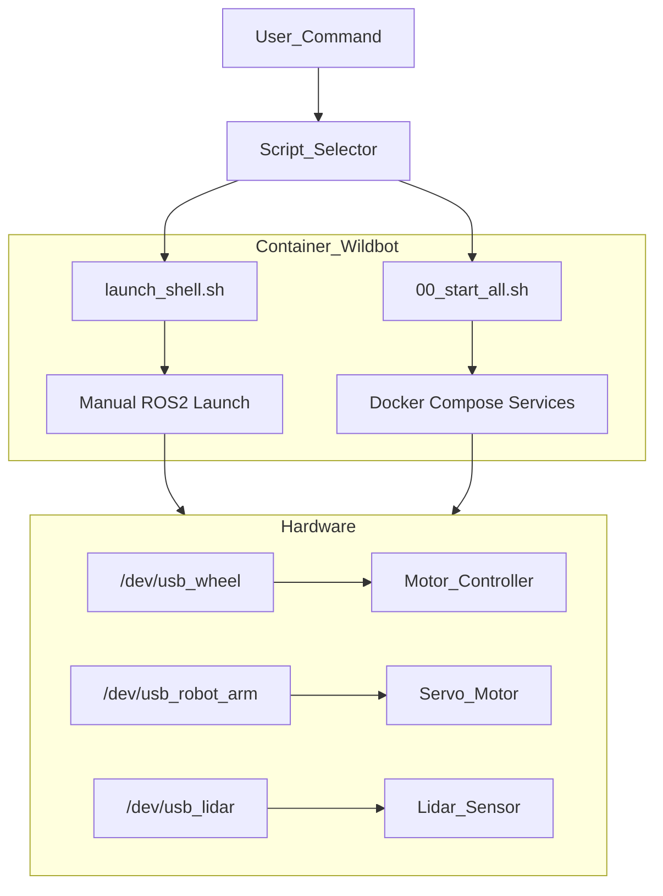

## 🤖 Wildbot 實體小車開發與操作核心準則

使用 ros2 jazzy 版本

### 1. 硬體設備映射規則 (USB Device Mapping)

在撰寫任何涉及硬體通訊（如 ROS2 Node 設定、Serial 通訊）的程式碼時，必須優先使用 **Symlink** 而非原始設備路徑，以確保設備重啟後的一致性。

| **設備名稱 (Symlink)** | **實際序列埠 (Device)** | **用途描述** | **備註標記** |
| --- | --- | --- | --- |
| `/dev/usb_wheel` | `/dev/ttyACM1` | 底盤電機控制器 | oradar |
| `/dev/usb_robot_arm` | `/dev/ttyUSB0` | 機械手臂伺服馬達 | - |
| `/dev/usb_lidar` | `/dev/ttyUSB1` | LiDAR 光學雷達 | ydlidar, imu_a9 |

---

### 2. 機械手臂安全防護規範 (Safety Constraints)

在撰寫機械手臂控制邏輯或 MoveIt 軌跡規劃時，**必須** 嵌入以下限制，違反規律可能導致硬體損毀或馬達燒毀。

### **角度限制 (Joint Limits)**

- **`arm_1_joint`**: $30^\circ \sim 210^\circ$（需檢查是否會碰撞地板）。
- **`arm_2_joint`**: $0^\circ \sim 240^\circ$（需檢查是否會碰撞地板）。
- **`gripper_joint` (夾爪)**:
    - **全開**: $240^\circ$
    - **閉合極限**: $168^\circ$
    - **警告**: 嚴禁指令角度小於 $168^\circ$，否則會發生「過夾 (Over-clamping)」導致馬達燒毀。

### **保護邏輯 (Auto-Release Logic)**

- **防燒毀機制**: 執行夾取動作後，必須在 **0.5 秒** 後自動退回 **$2^\circ$**，以釋放馬達持續堵轉的壓力。

---

### 3. 系統運行與除錯工作流

AI 提供的腳本或操作指令必須區分「開發環境」與「正式部署」兩大場景。

### **開發與調試 (Development & Debug)**

- **指令**: `sudo ./launch_shell.sh`
- **行為**: 啟動並進入 `wildbot` 主容器終端機 (bash)。
- **情境**: 編譯程式碼 (`colcon build`)、測試新驅動、手動執行單一 ROS2 Node。
- **路徑**: `/home/robot/wildbot_real car/wildbot_workspace-main`

### **正式全機運行 (Production/Deployment)**

- **指令**: `sudo ./scripts/00_start_all.sh`
- **行為**: 透過 `docker-compose` 背景啟動所有服務（底盤、相機、雷達、Bridge）。
- **進入運行中容器**: `docker exec -it compose-kros_car-1 bash`
- **情境**: 執行正式任務、機器人自主移動。

---

### 4. 系統架構圖 (Mermaid for Notion)

在協助規劃邏輯時，請參考以下架構，注意標籤不使用括號與特殊字元。

---

### 5. AI 回答原則

- **簡約優先**: 除非使用者要求「詳細」，否則代碼與建議以簡單、直接、易於維護為最高準則。
- **繁體中文**: 所有回覆與註解需使用繁體中文。
- **事實查核**: 針對法規、特定庫 (Library) 版本或硬體規範，僅依據確切已知事實回答。若信心不足，請標註「【資料不足，無法確認】」。
- **不確定的資訊**: 若無法確認硬體狀態或參數是否正確，請直接回答「不知道」。

---

**後續開發建議：**

當你在測試 YDLIDAR 或其他新硬體時，請先在 `launch_shell.sh` 環境下完成 `colcon build` 與節點測試。確認 `/dev/usb_lidar` 能正確讀取數據後，我們再將對應的 Launch 指令整合進 `docker-compose.yml` 中，由 `00_start_all.sh` 統一管理。