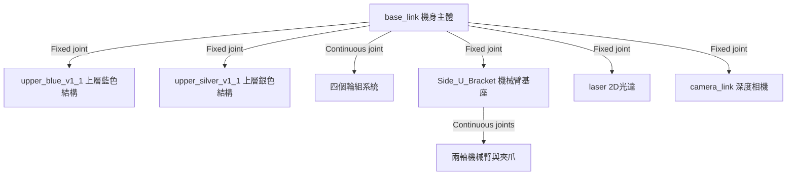

# Wildbot Real Car 實體小車系統 README

本專案為 **Wildbot 競賽實體機器人 (kros_car)** 之 ROS 2 開發、部署與操作核心知識庫。整合全向/差速移動底盤、兩軸機械手臂、2D LiDAR 光達與 3D 深度相機，具備自主導航與物件抓取能力。

---

## 1. 系統規格與設備架構 (Hardware & System Specs)

### 1.1 主控設備規格
- **機型**: ASUS ExpertCenter PN54 (Ryzen AI 7 350, Zen 5 + Zen 5c)
- **AI 加速 (NPU)**: AMD XDNA™ 2 (50 TOPS算力)
- **顯示晶片 (GPU)**: AMD Radeon™ 800M (RDNA 3.5 架構)
- **作業系統 / ROS 2**: Ubuntu 24.04 LTS / ROS 2 Jazzy

### 1.2 自由度與控制維度
- **位形空間 (Configuration Space)**: 3 個控制維度 \((x, y, \theta)\)
- **速度空間 (Velocity Space)**: 2 個自由度（線速度 \(v\)、角速度 \(\omega\)）

### 1.3 系統架構圖 (Mermaid)



---

## 2. 硬體設備映射規則 (USB Device Mapping)

所有與硬體節點溝通之 Serial/USB 通訊**必須**使用指定之 Symlink：

| 設備名稱 (Symlink) | 實際序列埠 (Device) | 用途描述 | 備註標記 |
| :--- | :--- | :--- | :--- |
| `/dev/usb_wheel` | `/dev/ttyACM1` | 底盤電機控制器 | oradar |
| `/dev/usb_robot_arm` | `/dev/ttyUSB0` | 機械手臂伺服馬達 | - |
| `/dev/usb_lidar` | `/dev/ttyUSB1` | LiDAR 光學雷達 / IMU | ydlidar, imu_a9 |

---

## 3. 機械手臂與夾爪安全防護規範 (Safety Constraints)

### 3.1 角度極限 (Joint Limits)
- `arm_1_joint`: \(30^\circ \sim 210^\circ\)（需確保避免與地板碰撞）
- `arm_2_joint`: \(0^\circ \sim 240^\circ\)（需確保避免與地板碰撞）
- `gripper_joint` (夾爪):
  - **全開角度**: \(240^\circ\)
  - **閉合極限**: \(168^\circ\)
  - ⚠️ **警告**: 嚴禁指令角度小於 \(168^\circ\)，避免過夾導致馬達毀損！

### 3.2 保護機制與自動釋放
- **防過壓機制**: 完成抓取後，必須於 **0.5 秒** 後自動退回 **\(2^\circ\)**，以釋放堵轉壓力。

### 3.3 溫度防護機制 (Thermal Protection)
監控話題 `/arm_joint_temperatures`（大臂、小臂、夾爪）：
- **過熱警告**: \(\ge 65^\circ\text{C}\) 發出警告訊息。
- **緊急停機 (E-Stop)**: \(\ge 70^\circ\text{C}\) 必須立即停止所有發送指令，攔截動作。
- **自動恢復**: 溫度回落至 \(60^\circ\text{C}\) 以下方可解除鎖定。

---

## 4. Docker 掛載結構與服務清單

### 4.1 核心路徑定義
- **主機根目錄**: `/home/robot/wildbot_real car/wildbot_workspace-main`
- **容器內根目錄**: `/workspaces`
- **主要環境啟用檔**: `/workspaces/install/setup.bash`

### 4.2 服務與啟動清單

| 服務名稱 (Service) | Compose 檔案 | 掛載路徑 (Host -> Container) | 啟動指令 (Source Path) |
| :--- | :--- | :--- | :--- |
| **底盤/手臂** | `kros_car.yml` | `.../wildbot_workspace-main:/workspaces` | `/workspaces/install/setup.bash` |
| **Rosbridge** | `rosbridge_server.yml` | `.../wildbot_workspace-main:/workspaces` | `/workspaces/install/setup.bash` |
| **LiDAR 驅動** | `ydlidar.yml` | `.../wildbot_workspace-main:/workspaces` | `/workspaces/install/setup.bash` |
| **IMU 驅動** | `kros_car.yml` | `.../wildbot_workspace-main:/workspaces` | `/workspaces/workspaces/imu_ws/install/setup.bash` |
| **手把控制** | `kros_car.yml` | `.../wildbot_workspace-main:/workspaces` | `/opt/ros/jazzy/setup.bash` |
| **YOLO 辨識** | `yolo.sh` | (繼承 kros_car 容器) | `/workspaces/workspaces/install/setup.bash` |

---

## 5. 系統運行與部署工作流 (Operation Workflows)

### 5.1 開發與調試模式 (Dev / Debug)
進入開發容器編譯程式碼或單獨測試 ROS 2 Node：
```bash
sudo ./launch_shell.sh
# 進入容器後編譯
colcon build --symlink-install
source install/setup.bash
```

### 5.2 正式全機部署 (Production)
使用 Docker Compose 啟動全機背景服務：
```bash
sudo ./scripts/00_start_all.sh
```

### 5.3 進入運行中容器與啟動 YOLO
```bash
# 進入運行中之 compose 容器
docker exec -it compose-kros_car-1 bash

# 手動啟動 YOLO 物件檢測 (節省資源)
./yolo.sh
```

---

## 6. 核心 ROS 2 Topics 參考

- **手臂控制**: `/arm_controller/joint_trajectory`, `/arm_joint_temperatures`
- **底盤控制**: `/base_controller/cmd_vel`, `/base_controller/odom`
- **感知話題**: `/scan` (LiDAR), `/camera/color/image_raw`, `/camera/depth/points`, `/imu/data`
- **狀態與變換**: `/joint_states`, `/tf`, `/tf_static`, `/robot_description`
- **導航與互動**: `/move_base_simple/goal`, `/initialpose`, `/diagnostics`

---

## 7. 測試與驗證方法 (Testing Guide)

> 💡 **說明**: 本專案遵循安全操作規範，不自動執行任何寫入與運轉測試。請依照以下步驟手動執行驗證：

### 步驟 1: 檢查 USB 裝置 Symlink 映射
在主機端確認設備識別：
```bash
ls -l /dev/usb_*
```
*預期結果*: 應顯示 `/dev/usb_wheel`, `/dev/usb_robot_arm`, `/dev/usb_lidar` 正確指向相對應的 tty 裝置。

### 步驟 2: 驗證 Docker 服務與 Topic 通訊
啟動全機服務後進入容器檢查話題狀態：
```bash
docker exec -it compose-kros_car-1 bash
source /workspaces/install/setup.bash
ros2 topic list
```
*預期結果*: 話題清單應畫面輸出包含 `/scan`, `/joint_states`, `/base_controller/odom` 等話題。

### 步驟 3: 馬達與手臂安全控制測試
發送小幅移動或話題調試指令前，務必確認車身周遭無障礙物並隨時準備按下緊急停止。
