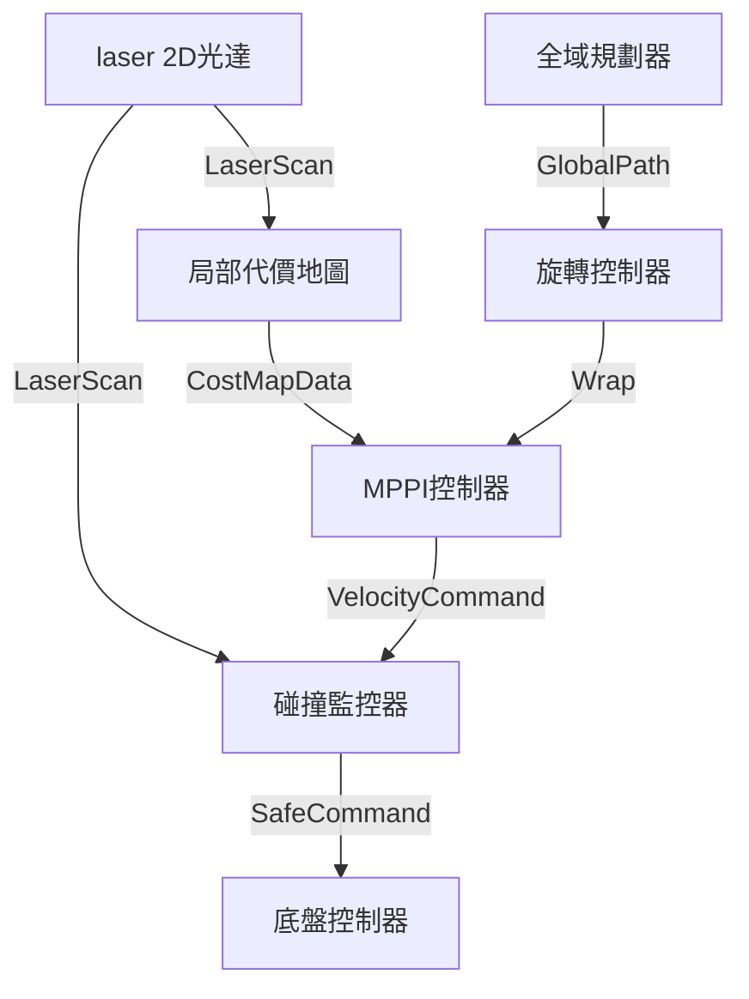

# 🤖 Wildbot 實體小車 Nav2 配置與主動避障優化技術筆記

本文件記錄了針對 Wildbot 實體小車（搭載兩軸機械臂與夾爪）在競賽環境中解決「目標點抖動亂跑」與「碰車即失格 (DQ)」等核心痛點的 Nav2 參數重構與避障策略。

---

## 1. 專案概述 (Overview)

本實作旨在對 Wildbot 的 Nav2 導航系統進行深度優化。藉由導入 `RotationShimController` 解決差速底盤在終點 Yaw 角度修正時的「前後晃動與亂跑」問題，並重新調優 `MPPIController` 的路徑評估權重與 `CollisionMonitor` 的防撞多邊形，實現**「大腦主動繞行 (MPPI + Costmap)」與「神經被動煞車 (StopZone)」**雙重安全保護機制，確保在激烈競賽中安全且流暢地完成任務。

---

## 2. 技術棧與環境 (Tech Stack)

*   **作業系統與機器人框架**：Linux (Ubuntu 24.04), ROS2 Jazzy
*   **導航框架**：Nav2 (Navigation2)
*   **控制器插件**：`nav2_rotation_shim_controller::RotationShimController`, `nav2_mppi_controller::MPPIController`
*   **碰撞監控**：`nav2_collision_monitor::CollisionMonitor`
*   **硬體配置**：
    *   主機：ASUS ExpertCenter PN54 (Ryzen AI 7 350, 4nm Zen 5/Zen 5c, 50 TOPS NPU)
    *   底盤模型：差速驅動模型 (DiffDrive)
    *   實體尺寸：長 60cm × 寬 40cm (含機械臂與夾爪包絡面)

---

## 3. 系統架構流程圖 (Architecture)

以下為優化後的小車導航與安全避障控制鏈路圖（Mermaid 格式，已適應 Notion 語法）：



---

## 4. 核心邏輯與程式碼 (Core Implementation)

以下為最終成功執行並應用於 `/home/robot/wildbot_real car/wildbot_workspace-main/workspaces/src/wildbot_nav2/config/nav2_params.yaml` 中的核心配置段落：

### A. 終點原地旋轉與運動模型修正 (RotationShim & DiffDrive)
我們將 MPPI 控制器包裝在 `RotationShimController` 內。當小車到達目標點的 XY 容許範圍後，由旋轉控制器接管進行原地旋轉。同時，為了配合差速底盤（無法橫向移動）的物理特性，將所有 Y 軸速度、標準差與限制皆設為 `0.0`，避免 MPPI 進行無效採樣。

```yaml
controller_server:
  ros__parameters:
    controller_frequency: 20.0
    min_x_velocity_threshold: 0.001
    min_y_velocity_threshold: 0.0         # 👈 差速底盤 Y 軸速度閥值設為 0
    min_theta_velocity_threshold: 0.001
    controller_plugins: ["FollowPath"]

    FollowPath:
      plugin: "nav2_rotation_shim_controller::RotationShimController" # 👈 使用旋轉包裝器
      primary_controller: "nav2_mppi_controller::MPPIController"     # 👈 指定主控制器為 MPPI
      angular_dist_threshold: 0.3925
      forward_sampling_distance: 0.5
      rotate_to_heading_angular_vel: 0.8
      max_angular_accel: 1.5
      rotate_to_goal_heading: true                                    # 👈 抵達 XY 容許區後，接管進行原地旋轉修正 Yaw
      
      # 以下為 MPPI 控制器參數
      time_steps: 56
      model_dt: 0.05
      batch_size: 2000
      motion_model: "DiffDrive"                                      # 👈 運動模型：差速驅動
      vx_std: 0.2
      vy_std: 0.0                                                    # 👈 差速底盤 Y 軸雜訊標準差設為 0
      wz_std: 0.4
      vx_max: 0.5
      vx_min: -0.35
      vy_max: 0.0                                                    # 👈 差速底盤 Y 軸最大速度設為 0
      wz_max: 1.9
```

### B. MPPI 避障權重與長方形輪廓評估 (Active Obstacle Avoidance)
大幅度降低路徑咬合度，提高障礙物懲罰，並開啟 `consider_footprint`。由於使用強大 Zen 5 CPU，開啟完整長方形足跡檢測可確保轉彎時手臂不會掃到對手。

```yaml
      critics: [
        "ConstraintCritic", "CostCritic", "GoalCritic",
        "GoalAngleCritic", "PathAlignCritic", "PathFollowCritic",
        "PathAngleCritic", "PreferForwardCritic"]
        
      CostCritic:
        enabled: true
        cost_power: 1
        cost_weight: 10.0            # 👈 提高障礙物權重（原 3.81），遇對手提早避讓
        near_collision_cost: 253
        critical_cost: 300.0
        consider_footprint: true     # 👈 開啟長方形實體輪廓計算，保護突出手臂（原 false）
        collision_cost: 1000000.0
        
      PathAlignCritic:
        enabled: true
        cost_power: 1
        cost_weight: 6.0             # 👈 降低路徑咬合度（原 14.0），釋放主動繞道意願
```

### C. 代價地圖參數與雙重安全防護區 (Costmap & Collision Monitor)
將代價地圖車體足跡擴大為包含手臂的 `60cm × 40cm`，局部地圖更新率提升至 `10 Hz`。並在 `collision_monitor` 中額外新增外擴 10cm 的長方形 `StopZone`，構成「瞬間煞車」的被動安全底線。

```yaml
local_costmap:
  local_costmap:
    ros__parameters:
      update_frequency: 10.0         # 👈 感知更新率由 5.0Hz 提升至 10.0Hz，降低延遲
      publish_frequency: 4.0
      footprint: "[[-0.30, -0.20], [-0.30, 0.20], [0.30, 0.20], [0.30, -0.20]]" # 👈 真實尺寸 (60x40cm)

global_costmap:
  global_costmap:
    ros__parameters:
      footprint: "[[-0.30, -0.20], [-0.30, 0.20], [0.30, 0.20], [0.30, -0.20]]" # 👈 同步更新
      inflation_layer:
        inflation_radius: 0.45       # 👈 地圖膨脹半徑由 0.35m 提升至 0.45m，與障礙物保持安全車距

collision_monitor:
  ros__parameters:
    polygons: ["StopZone", "FootprintApproach"] # 👈 新增 StopZone 煞車區
    StopZone:
      type: "polygon"
      points: "[[-0.40, -0.30], [-0.40, 0.30], [0.40, 0.30], [0.40, -0.30]]" # 👈 外擴 10cm 防護罩 (80x60cm)
      action_type: "stop"
      min_points: 3                  # 👈 只要有 3 個雷達點進入便啟動強迫煞車，提高敏感度
      visualize: True
      enabled: True
```

---

## 5. 執行與操作步驟 (How to Run)

由於導航參數是寫在配置 YAML 檔中，系統部署與操作流程如下：

1.  **啟動底盤與感測器服務**（在 Host 終端機執行）：
    ```bash
    cd "/home/robot/wildbot_real car/wildbot_workspace-main"
    sudo ./scripts/00_start_all.sh
    ```
2.  **進入開發容器進行編譯**（若未採用 symlink-install，則必須重新編譯）：
    ```bash
    # 進入容器
    sudo ./launch_shell.sh
    # 在容器內編譯 nav2 套件
    colcon build --packages-select wildbot_nav2
    ```
3.  **啟動導航節點**：
    執行導航啟動腳本（如 `nav2.sh`），此時系統會自動加載 `/workspaces/install/share/wildbot_nav2` 底下的新參數。

---

## 6. 已知問題與後續擴充 (Next Steps)

*   **馬達物理死區（Deadband）**：當小車在終點前修正極小角度時，Nav2 發出的細微 `cmd_vel` 可能因地面與輪胎摩擦力無法使馬達運轉。未來需在底盤驅動節點（如 `base_controller`）內加入死區濾波與最小起步扭力補償。
*   **狹窄死角卡死**：調大 `inflation_radius` 雖然可以預防碰撞，但在極度狹窄的賽道中（如門口或過橋）可能導致全局規劃器找不到路。若遇此情況，可微調調降 `global_costmap` 的膨脹半徑至 `0.40`，並優化行為樹（Behavior Tree）中的 `Recovery` 旋轉與後退重試機制。
