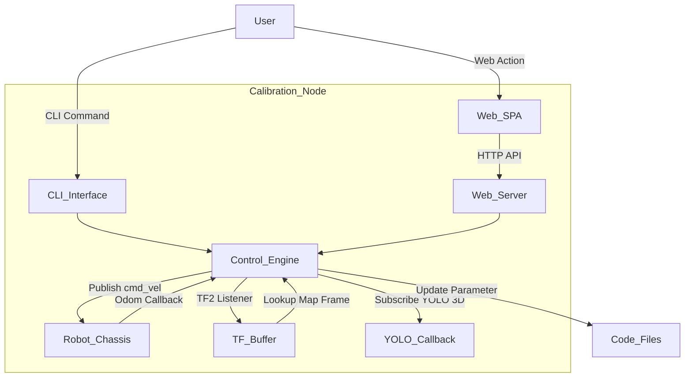

# 🤖 Wildbot 實體小車參數校正與系統監控技術筆記

---

## 1. 專案概述 (Overview)
本實作旨在解決實體機器人因物理摩擦、地面材質打滑或機械裝配偏差（如相機安裝座、手臂基座）所導致的定位與控制誤差。

我們建立了一套**高質感、雙模態（Web UI 與 CLI 終端機）**的參數校正與系統監控儀表板。該系統支援底盤直線打滑係數（factor）、手臂安裝距（BUMPER_X）與相機深度補償（distance_offset）的自動化計算與寫入修正，大幅降低了現場調校的人力成本與操作難度。

---

## 2. 技術棧與環境 (Tech Stack)
*   **機器人作業系統**：ROS2 Jazzy
*   **底盤控制**：`/base_controller/cmd_vel` (`geometry_msgs/msg/TwistStamped`)
*   **定位系統**：Nav2 / TF2 坐標變換系統
*   **視覺偵測**：YOLO 3D 物體檢測器 (`yolo_msgs/msg/DetectionArray`)
*   **核心語言與環境**：Python 3.12 (ROS2 Node + 多線程 HTTP Server)
*   **網頁技術**：HTML5 / CSS3 (毛玻璃 Glassmorphism 響應式 Dark Mode) / Vanilla JavaScript (ES6 Fetch 雙向 API 異步請求)
*   **運算設備**：AMD Ryzen AI 7 350 (ASUS ExpertCenter PN54) 具備 NPU AI 加速

---

## 3. 系統架構流程圖 (Architecture)



---

## 4. 核心邏輯與程式碼 (Core Implementation)

### 核心模組一：雙模態控制與即時監控
系統採用 Python 內建的 `http.server` 實作 Web 服務，無需在 Docker 容器內額外安裝 Flask 等第三方依賴。Web 伺服器與 CLI 命令列選單透過 `threading.Thread` 與 ROS 2 節點的多線程 Executor 並存運作，實現了網頁操作與終端機調試的雙向數據同步。

### 核心模組二：精密物理校正幾何與 TF2 定位監聽
1.  **第二軸中心對齊 BUMPER_X 校正幾何**：
    將原先測量「前擋板到懸空夾爪」的模糊距離，優化為量測「前擋板到手臂第二軸旋轉中心（馬達實體軸心）」的精確水平距離 $X_{actual}$。
    藉由大臂正運動學公式計算第二軸理論 X 座標：
    $$X_{j2\_theory} = \text{BASE\_X} + L1 \times \cos(2.0 - q1)$$
    再依據實測推算 BUMPER_X 新參數：
    $$\text{BUMPER\_X}_{new} = \text{BUMPER\_X}_{current} + \frac{X_{theory\_cm} - X_{actual\_cm}}{100.0}$$
2.  **Nav2 全局定位監聽**：
    實作 `tf2_ros` 監聽器，以非阻塞方式（20ms 逾時限制）在背景查找 `map` 到 `base_link` 的 TF 變換關係。若成功獲取則即時解算全機在地圖坐標系下的 3D 位置與 Yaw 角度；若 Nav2 定位未啟用，則自動捕獲異常並回報 `None`，向使用者溫和反饋「沒有開啟 Nav」，避免節點崩潰。

### 核心模組三：相機亮度與對比度校正（解決方案 A：軟體影像即時調光與轉發機制）
1.  **影像話題重新映射 (Remapping)**：
    由於大白相機（Orbbec SDK）在底層驅動中限制了在執行期（Runtime）動態修改硬體亮度與曝光參數，本系統透過在 `gemini_ew.launch.py` 中將相機原生彩色話題映射至 `/camera/color/image_raw_raw`，釋放出真話題 `/camera/color/image_raw` 作為已調光發布話題。
2.  **影像原生重塑與軟體調光濾鏡**：
    訂閱 `/camera/color/image_raw_raw`，採用 Python 原生 Numpy 的 `np.frombuffer` 解析重塑為 OpenCV 矩陣。隨後使用 OpenCV 的 `cv2.convertScaleAbs` 進行即時調光運算：
    $$g(x,y) = \alpha \cdot f(x,y) + \beta$$
    *   **亮度偏移 $\beta$ (Brightness)**：範圍為 `-100 ~ 100`。
    *   **對比度增益 $\alpha$ (Contrast)**：線性映射公式為 $\alpha = 1.0 + (\text{contrast\_param} - 50) \times 0.02$，範圍為 `0 ~ 2.0`。
3.  **無延遲影像重新發布與時間戳保持**：
    運算完成後，將影格轉換為 ROS 2 `sensor_msgs.msg.Image` 並重新發布至真話題 `/camera/color/image_raw`。在轉換過程中**保持原始影像的 header 與時間戳不變**，無縫相容 `compress` 壓縮服務，確保 Foxglove 畫面以及 YOLO 3D 偵測的時間同步匹配（Slop 匹配）不會因為軟體濾鏡而逾時。
4.  **非阻塞多線程 Executor 與持久化**：
    節點以獨立的執行緒進行 ROS 2 異步 spin，前台迴圈只負責 OpenCV GUI 顯示與按鍵偵測，徹底消除了 CLI input 阻塞影像處理或 Executor 重複 spin 的衝突。調整完成後，按 [S] 存檔可自動持久化寫入 `camera_config.json`，在小車重啟後自動加載生效。

### 最終版完整可執行程式碼 (`calibration_tool.py`)
```python
import os
import sys
# 將當前檔案所在的目錄加入 sys.path，解決 ros2 run 時 ModuleNotFoundError 問題
sys.path.insert(0, os.path.dirname(os.path.abspath(__file__)))

import rclpy
from rclpy.node import Node
import math
import time
import threading
import re
from http.server import BaseHTTPRequestHandler, HTTPServer
import json
from geometry_msgs.msg import TwistStamped
from nav_msgs.msg import Odometry
from yolo_msgs.msg import DetectionArray
from arm_interface import ArmInterface
from tf2_ros import TransformException
from tf2_ros.buffer import Buffer
from tf2_ros.transform_listener import TransformListener

# ==============================================================================
# 🌐 網頁前端 HTML 與 CSS 設計 (高質感毛玻璃 Dark Mode + 響應式佈局)
# ==============================================================================
HTML_CONTENT = """<!DOCTYPE html>
<html lang="zh-Hant">
<head>
    <meta charset="UTF-8">
    <meta name="viewport" content="width=device-width, initial-scale=1.0">
    <title>🤖 Wildbot 參數校正儀表板</title>
    <link href="https://fonts.googleapis.com/css2?family=Outfit:wght@300;400;600;700&family=Noto+Sans+TC:wght@400;500;700&display=swap" rel="stylesheet">
    <style>
        :root {
            --bg-color: #0b0f19;
            --card-bg: rgba(17, 24, 39, 0.7);
            --card-border: rgba(255, 255, 255, 0.08);
            --primary: #6366f1;
            --primary-glow: rgba(99, 102, 241, 0.35);
            --success: #10b981;
            --success-glow: rgba(16, 185, 129, 0.35);
            --warning: #f59e0b;
            --danger: #ef4444;
            --danger-glow: rgba(239, 68, 68, 0.3);
            --text-main: #f3f4f6;
            --text-muted: #9ca3af;
        }
        
        * {
            box-sizing: border-box;
            margin: 0;
            padding: 0;
        }
        
        body {
            background-color: var(--bg-color);
            color: var(--text-main);
            min-height: 100vh;
            font-family: 'Outfit', 'Noto Sans TC', -apple-system, sans-serif;
            display: flex;
            flex-direction: column;
            background-image: 
                radial-gradient(at 10% 20%, rgba(99, 102, 241, 0.15) 0px, transparent 50%),
                radial-gradient(at 90% 80%, rgba(16, 185, 129, 0.1) 0px, transparent 50%);
            background-attachment: fixed;
        }
        
        header {
            display: flex;
            justify-content: space-between;
            align-items: center;
            padding: 20px 40px;
            border-bottom: 1px solid var(--card-border);
            backdrop-filter: blur(12px);
            position: sticky;
            top: 0;
            z-index: 100;
            background: rgba(11, 15, 25, 0.8);
        }
        
        .logo {
            font-size: 24px;
            font-weight: 700;
            background: linear-gradient(to right, #818cf8, #34d399);
            -webkit-background-clip: text;
            -webkit-text-fill-color: transparent;
            display: flex;
            align-items: center;
            gap: 10px;
        }
        
        .status-badge {
            background: rgba(16, 185, 129, 0.12);
            border: 1px solid var(--success);
            color: var(--success);
            padding: 6px 18px;
            border-radius: 20px;
            font-size: 14px;
            font-weight: 600;
            display: flex;
            align-items: center;
            gap: 8px;
            box-shadow: 0 0 12px var(--success-glow);
        }
        
        .status-badge.danger {
            background: rgba(239, 68, 68, 0.12);
            border: 1px solid var(--danger);
            color: var(--danger);
            box-shadow: 0 0 12px var(--danger-glow);
        }
        
        .main-container {
            display: grid;
            grid-template-columns: 1.1fr 1.9fr;
            gap: 30px;
            padding: 30px 40px;
            flex: 1;
        }
        
        .left-col, .right-col {
            display: flex;
            flex-direction: column;
            gap: 30px;
        }
        
        .card {
            background: var(--card-bg);
            border: 1px solid var(--card-border);
            border-radius: 16px;
            padding: 24px;
            backdrop-filter: blur(16px);
            box-shadow: 0 8px 32px 0 rgba(0, 0, 0, 0.4);
            transition: transform 0.3s ease, border-color 0.3s ease;
        }
        
        .card:hover {
            border-color: rgba(99, 102, 241, 0.25);
        }
        
        .card-title {
            font-size: 18px;
            font-weight: 600;
            margin-bottom: 20px;
            display: flex;
            align-items: center;
            gap: 10px;
            border-bottom: 1px solid rgba(255, 255, 255, 0.08);
            padding-bottom: 12px;
        }
        
        .info-grid {
            display: grid;
            grid-template-columns: 1fr 1fr;
            gap: 16px;
        }
        
        .info-item {
            background: rgba(255, 255, 255, 0.03);
            border-radius: 10px;
            padding: 14px;
            border: 1px solid rgba(255, 255, 255, 0.03);
        }
        
        .info-label {
            font-size: 12px;
            color: var(--text-muted);
            text-transform: uppercase;
            margin-bottom: 6px;
            letter-spacing: 0.5px;
        }
        
        .info-value {
            font-size: 18px;
            font-weight: 700;
            color: #e5e7eb;
        }
        
        .tab-buttons {
            display: flex;
            background: rgba(0, 0, 0, 0.25);
            padding: 4px;
            border-radius: 12px;
            margin-bottom: 24px;
            border: 1px solid var(--card-border);
        }
        
        .tab-btn {
            flex: 1;
            background: transparent;
            border: none;
            color: var(--text-muted);
            padding: 12px;
            border-radius: 10px;
            cursor: pointer;
            font-weight: 600;
            font-size: 14px;
            transition: all 0.25s ease;
        }
        
        .tab-btn.active {
            background: var(--primary);
            color: white;
            box-shadow: 0 4px 12px var(--primary-glow);
        }
        
        .tab-content {
            display: none;
        }
        
        .tab-content.active {
            display: block;
            animation: fadeIn 0.4s ease;
        }
        
        @keyframes fadeIn {
            from { opacity: 0; transform: translateY(5px); }
            to { opacity: 1; transform: translateY(0); }
        }
        
        .input-group {
            display: flex;
            flex-direction: column;
            gap: 8px;
            margin-bottom: 18px;
        }
        
        .input-group label {
            font-size: 14px;
            color: var(--text-muted);
        }
        
        .input-row {
            display: flex;
            gap: 12px;
        }
        
        input[type="number"], input[type="text"] {
            background: rgba(0, 0, 0, 0.35);
            border: 1px solid var(--card-border);
            border-radius: 8px;
            padding: 12px 16px;
            color: white;
            font-size: 15px;
            flex: 1;
            transition: all 0.2s ease;
        }
        
        input[type="number"]:focus, input[type="text"]:focus {
            outline: none;
            border-color: var(--primary);
            box-shadow: 0 0 8px var(--primary-glow);
        }
        
        .btn {
            background: linear-gradient(135deg, var(--primary), #4f46e5);
            color: white;
            border: none;
            border-radius: 8px;
            padding: 12px 24px;
            font-size: 15px;
            font-weight: 600;
            cursor: pointer;
            transition: all 0.25s ease;
            box-shadow: 0 4px 12px var(--primary-glow);
            display: inline-flex;
            align-items: center;
            justify-content: center;
            gap: 8px;
        }
        
        .btn:hover {
            transform: translateY(-2px);
            box-shadow: 0 6px 16px var(--primary-glow);
            filter: brightness(1.15);
        }
        
        .btn:active {
            transform: translateY(0);
        }
        
        .btn-success {
            background: linear-gradient(135deg, var(--success), #059669);
            box-shadow: 0 4px 12px var(--success-glow);
        }
        
        .btn-success:hover {
            box-shadow: 0 6px 16px var(--success-glow);
        }
        
        .btn-warning {
            background: linear-gradient(135deg, var(--warning), #d97706);
            box-shadow: 0 4px 12px rgba(245, 158, 11, 0.3);
        }
        
        .btn:disabled {
            background: #374151 !important;
            box-shadow: none !important;
            cursor: not-allowed;
            transform: none !important;
            opacity: 0.6;
        }
        
        .progress-container {
            margin: 20px 0;
            background: rgba(255, 255, 255, 0.05);
            border-radius: 10px;
            padding: 16px;
            border: 1px solid var(--card-border);
            display: none;
        }
        
        .progress-text {
            display: flex;
            justify-content: space-between;
            font-size: 14px;
            margin-bottom: 8px;
        }
        
        .progress-bar-bg {
            height: 12px;
            background: rgba(0,0,0,0.4);
            border-radius: 6px;
            overflow: hidden;
        }
        
        .progress-bar-fill {
            height: 100%;
            width: 0%;
            background: linear-gradient(to right, #818cf8, #34d399);
            border-radius: 6px;
            transition: width 0.15s ease;
        }
        
        .alert-box {
            background: rgba(239, 68, 68, 0.1);
            border: 1px solid rgba(239, 68, 68, 0.4);
            color: #fca5a5;
            padding: 16px;
            border-radius: 10px;
            margin-bottom: 20px;
            display: none;
            align-items: center;
            gap: 12px;
        }
        
        .alert-icon {
            font-size: 20px;
        }
        
        .yolo-list {
            display: flex;
            flex-direction: column;
            gap: 12px;
            max-height: 250px;
            overflow-y: auto;
        }
        
        .yolo-item {
            background: rgba(255, 255, 255, 0.02);
            border: 1px solid rgba(255, 255, 255, 0.05);
            border-left: 4px solid var(--primary);
            border-radius: 0 10px 10px 0;
            padding: 14px;
            display: flex;
            flex-direction: column;
            gap: 6px;
        }
        
        .yolo-header {
            display: flex;
            justify-content: space-between;
            align-items: center;
        }
        
        .yolo-name {
            font-weight: 700;
            color: #818cf8;
        }
        
        .yolo-score {
            font-size: 12px;
            color: var(--success);
            background: rgba(16, 185, 129, 0.1);
            padding: 2px 8px;
            border-radius: 6px;
            font-weight: 600;
        }
        
        .yolo-detail {
            font-size: 13px;
            color: var(--text-muted);
            display: grid;
            grid-template-columns: 1fr 1fr;
            gap: 6px;
        }
        
        .toast {
            position: fixed;
            bottom: 30px;
            right: 30px;
            background: rgba(15, 23, 42, 0.95);
            border: 1px solid var(--primary);
            border-radius: 10px;
            padding: 16px 28px;
            color: white;
            box-shadow: 0 10px 40px rgba(0,0,0,0.6);
            transform: translateY(120px);
            opacity: 0;
            transition: all 0.3s cubic-bezier(0.16, 1, 0.3, 1);
            z-index: 1000;
            backdrop-filter: blur(10px);
        }
        
        .toast.show {
            transform: translateY(0);
            opacity: 1;
        }
        
        .toast.success {
            border-color: var(--success);
        }
        
        .toast.error {
            border-color: var(--danger);
        }
        
        .loader {
            border: 2.5px solid rgba(255, 255, 255, 0.1);
            border-top: 2.5px solid white;
            border-radius: 50%;
            width: 16px;
            height: 16px;
            animation: spin 0.8s linear infinite;
            display: none;
        }
        
        @keyframes spin {
            0% { transform: rotate(0deg); }
            100% { transform: rotate(360deg); }
        }
    </style>
</head>
<body>

    <header>
        <div class="logo">
            <span>🤖</span> Wildbot Calibration Dashboard
        </div>
        <div id="estop_badge" class="status-badge">
            <span class="pulse-dot">●</span> 系統連線正常
        </div>
    </header>

    <div class="main-container">
        
        <!-- 左側欄：系統狀態資訊卡片 -->
        <div class="left-col">
            
            <!-- 異常警報 -->
            <div id="overheat_alert" class="alert-box">
                <span class="alert-icon">⚠️</span>
                <div>
                    <strong>馬達嚴重過熱 (≥70°C)</strong>
                    <div style="font-size: 13px; opacity: 0.8; margin-top: 2px;">底盤與手臂已安全鎖定，請等待降溫至60°C以下。</div>
                </div>
            </div>
            
            <!-- 底盤狀態 -->
            <div class="card">
                <div class="card-title">🚗 底盤里程計</div>
                <div class="info-grid">
                    <div class="info-item">
                        <div class="info-label">座標 X (m)</div>
                        <div id="odom_x" class="info-value">0.000</div>
                    </div>
                    <div class="info-item">
                        <div class="info-label">座標 Y (m)</div>
                        <div id="odom_y" class="info-value">0.000</div>
                    </div>
                    <div class="info-item" style="grid-column: span 2;">
                        <div class="info-label">朝向角 (Yaw)</div>
                        <div id="odom_yaw" class="info-value">0.0° (0.000 rad)</div>
                    </div>
                </div>
            </div>
            
            <!-- Nav2 定位狀態 -->
            <div class="card">
                <div class="card-title">🗺️ Nav2 地圖定位</div>
                <div id="nav_status_text" style="font-size: 14px; color: var(--text-muted); margin-bottom: 10px;">
                    未偵測到定位服務
                </div>
                <div id="nav_info_grid" class="info-grid" style="display: none;">
                    <div class="info-item">
                        <div class="info-label">地圖 X (m)</div>
                        <div id="nav_x" class="info-value">0.000</div>
                    </div>
                    <div class="info-item">
                        <div class="info-label">地圖 Y (m)</div>
                        <div id="nav_y" class="info-value">0.000</div>
                    </div>
                    <div class="info-item" style="grid-column: span 2;">
                        <div class="info-label">地圖 朝向 (Yaw)</div>
                        <div id="nav_yaw" class="info-value">0.0° (0.000 rad)</div>
                    </div>
                </div>
            </div>
            
            <!-- 手臂狀態 -->
            <div class="card">
                <div class="card-title">🦾 機械手臂狀態</div>
                <div class="info-grid">
                    <div class="info-item">
                        <div class="info-label">大臂 Q1 (deg)</div>
                        <div id="arm_q1" class="info-value">0.0°</div>
                    </div>
                    <div class="info-item">
                        <div class="info-label">小臂 Q2 (deg)</div>
                        <div id="arm_q2" class="info-value">0.0°</div>
                    </div>
                    <div class="info-item">
                        <div class="info-label">夾爪 (deg)</div>
                        <div id="arm_grip" class="info-value">0.0°</div>
                    </div>
                    <div class="info-item">
                        <div class="info-label">BUMPER_X (m)</div>
                        <div id="current_bumper_x" class="info-value">0.13063</div>
                    </div>
                    <div class="info-item" style="grid-column: span 2;">
                        <div class="info-label">夾爪座標 (距前板 / 離地)</div>
                        <div id="gripper_pos" class="info-value">X: -- cm | Z: -- cm</div>
                    </div>
                    <div class="info-item" style="grid-column: span 2;">
                        <div class="info-label">馬達溫度 (Q1 / Q2 / Grip)</div>
                        <div id="arm_temps" class="info-value">--°C / --°C / --°C</div>
                    </div>
                </div>
            </div>
            
        </div>
        
        <!-- 右側欄：校正操作區與 YOLO 3D 偵測 -->
        <div class="right-col">
            
            <!-- 校正面板 -->
            <div class="card">
                <div class="card-title">⚙️ 校正操作面板</div>
                
                <div class="tab-buttons">
                    <button class="tab-btn active" onclick="switchTab('tab_straight')">走直線</button>
                    <button class="tab-btn" onclick="switchTab('tab_rotate')">轉角度</button>
                    <button class="tab-btn" onclick="switchTab('tab_gripper')">第二軸距</button>
                    <button class="tab-btn" onclick="switchTab('tab_camera')">相機距</button>
                </div>
                
                <!-- 直線進度條 -->
                <div id="progress_box" class="progress-container">
                    <div class="progress-text">
                        <span id="progress_label">正在執行校正前進...</span>
                        <span id="progress_num">0.0 cm / 0.0 cm</span>
                    </div>
                    <div class="progress-bar-bg">
                        <div id="progress_fill" class="progress-bar-fill"></div>
                    </div>
                </div>
                
                <!-- Tab: 走直線 -->
                <div id="tab_straight" class="tab-content active">
                    <div class="input-group">
                        <label>測試前進距離 (公尺)</label>
                        <input type="number" id="straight_target" value="0.5" step="0.1" min="0.1">
                    </div>
                    <button id="btn_straight_run" class="btn" onclick="runStraight()">
                        <span>🚗 啟動小車前進</span>
                    </button>
                    
                    <div style="margin-top: 25px; border-top: 1px dashed rgba(255,255,255,0.08); padding-top: 20px;">
                        <div class="input-group">
                            <label>實體皮尺量測實際前進距離 (公尺)</label>
                            <div class="input-row">
                                <input type="number" id="straight_actual" placeholder="例如: 0.42" step="0.01">
                                <button id="btn_straight_submit" class="btn btn-success" onclick="submitStraight()">套用補償 (factor)</button>
                            </div>
                        </div>
                    </div>
                </div>
                
                <!-- Tab: 旋轉 -->
                <div id="tab_rotate" class="tab-content">
                    <div class="input-group">
                        <label>測試旋轉角度 (度，正為逆時針，負為順時針)</label>
                        <input type="number" id="rotate_target" value="90" step="5">
                    </div>
                    <button id="btn_rotate_run" class="btn" onclick="runRotate()">
                        <span>🔄 啟動原地旋轉</span>
                    </button>
                    
                    <div style="margin-top: 25px; border-top: 1px dashed rgba(255,255,255,0.08); padding-top: 20px;">
                        <div class="input-group">
                            <label>小車實際物理旋轉的角度 (度)</label>
                            <div class="input-row">
                                <input type="number" id="rotate_actual" placeholder="例如: 85" step="1">
                                <button id="btn_rotate_submit" class="btn btn-success" onclick="submitRotate()">計算旋轉補償</button>
                            </div>
                        </div>
                    </div>
                </div>
                
                <!-- Tab: 第二軸距 -->
                <div id="tab_gripper" class="tab-content">
                    <p style="font-size: 14px; color: var(--text-muted); margin-bottom: 15px;">
                        校正手臂第二軸 (arm_2_joint) 中心至前擋板 the 距離，修正手臂正運動學的 BUMPER_X 參數。
                    </p>
                    <button id="btn_move_pose_1" class="btn btn-warning" onclick="moveToPose1()" style="margin-bottom: 20px;">
                        <span>🚀 移動手臂至校正點位 1</span>
                    </button>
                    
                    <div class="info-grid" style="margin-bottom: 20px;">
                        <div class="info-item" style="background: rgba(99, 102, 241, 0.05); border-color: rgba(99, 102, 241, 0.15);">
                            <div class="info-label" style="color: #818cf8;">當前計算之理論第二軸中心距</div>
                            <div id="theoretical_x_g" class="info-value">-- cm</div>
                        </div>
                    </div>
                    
                    <div class="input-group">
                        <label>皮尺實測第二軸中心到前擋板之實際距離 (公分)</label>
                        <div class="input-row">
                            <input type="number" id="gripper_actual" placeholder="例如: 11.5" step="0.1">
                            <button id="btn_gripper_submit" class="btn btn-success" onclick="submitGripper()">套用 BUMPER_X</button>
                        </div>
                    </div>
                </div>
                
                <!-- Tab: 相機距 -->
                <div id="tab_camera" class="tab-content">
                    <p style="font-size: 14px; color: var(--text-muted); margin-bottom: 15px;">
                        校正 3D 相機偵測的物體深度，修正 camera and grab.py 中的 distance_offset 參數。
                    </p>
                    <div class="input-group">
                        <label>指定校正目標物類別名稱 (如 blue_box，留空取第一個)</label>
                        <input type="text" id="camera_class_filter" placeholder="預設: 取所有偵測物">
                    </div>
                    
                    <div class="info-grid" style="margin-bottom: 20px;">
                        <div class="info-item" style="background: rgba(99, 102, 241, 0.05); border-color: rgba(99, 102, 241, 0.15);">
                            <div class="info-label" style="color: #818cf8;">相機預估物體距前擋板</div>
                            <div id="camera_detected_x" class="info-value">-- cm</div>
                        </div>
                    </div>
                    
                    <div class="input-group">
                        <label>皮尺實測物體中心到前擋板之實際距離 (公分)</label>
                        <div class="input-row">
                            <input type="number" id="camera_actual" placeholder="例如: 33.0" step="0.1">
                            <button id="btn_camera_submit" class="btn btn-success" onclick="submitCamera()">套用 distance_offset</button>
                        </div>
                    </div>
                </div>
                
            </div>
            
            <!-- YOLO 偵測清單 -->
            <div class="card">
                <div class="card-title">📷 YOLO 3D 實時偵測清單</div>
                <div id="yolo_container" class="yolo-list">
                    <div style="text-align: center; color: var(--text-muted); padding: 20px; font-size: 14px;">
                        ⏳ 正在等待 YOLO 3D 偵測數據...
                    </div>
                </div>
            </div>
            
        </div>
        
    </div>

    <div id="toast" class="toast">提示訊息</div>

    <script>
        let currentTab = 'tab_straight';
        let currentStatus = {};
        
        function switchTab(tabId) {
            document.querySelectorAll('.tab-btn').forEach(btn => btn.classList.remove('active'));
            document.querySelectorAll('.tab-content').forEach(content => content.classList.remove('active'));
            
            const btnIndex = ['tab_straight', 'tab_rotate', 'tab_gripper', 'tab_camera'].indexOf(tabId);
            document.querySelectorAll('.tab-btn')[btnIndex].classList.add('active');
            document.getElementById(tabId).classList.add('active');
            currentTab = tabId;
        }
        
        function showToast(text, type = 'success') {
            const toast = document.getElementById('toast');
            toast.textContent = text;
            toast.className = `toast show ${type}`;
            setTimeout(() => {
                toast.classList.remove('show');
            }, 3500);
        }
        
        async function postAPI(url, data = {}) {
            try {
                const response = await fetch(url, {
                    method: 'POST',
                    headers: { 'Content-Type': 'application/json' },
                    body: JSON.stringify(data)
                });
                return await response.json();
            } catch (e) {
                console.error(e);
                showToast('API 呼叫失敗，請檢查網路連線', 'error');
                return { success: false, message: '網路錯誤' };
            }
        }
        
        // 1. 直線
        async function runStraight() {
            const distance = parseFloat(document.getElementById('straight_target').value);
            if (isNaN(distance) || distance <= 0) {
                showToast('請輸入有效的前進距離', 'error');
                return;
            }
            const res = await postAPI('/api/move_straight', { distance });
            if (res.success) {
                showToast(res.message);
            }
        }
        
        async function submitStraight() {
            const target = parseFloat(document.getElementById('straight_target').value);
            const actual = parseFloat(document.getElementById('straight_actual').value);
            if (isNaN(actual) || actual <= 0) {
                showToast('請輸入實際量測距離', 'error');
                return;
            }
            const res = await postAPI('/api/submit_straight_actual', {
                target_distance: target,
                actual_distance: actual
            });
            if (res.success) {
                showToast(res.message);
                document.getElementById('straight_actual').value = '';
            } else {
                showToast(res.message, 'error');
            }
        }
        
        // 2. 旋轉
        async function runRotate() {
            const angle = parseFloat(document.getElementById('rotate_target').value);
            if (isNaN(angle) || angle === 0) {
                showToast('請輸入旋轉角度', 'error');
                return;
            }
            const res = await postAPI('/api/rotate', { angle });
            if (res.success) {
                showToast(res.message);
            }
        }
        
        async function submitRotate() {
            const target = parseFloat(document.getElementById('rotate_target').value);
            const actual = parseFloat(document.getElementById('rotate_actual').value);
            if (isNaN(actual) || actual === 0) {
                showToast('請輸入實際角度', 'error');
                return;
            }
            const res = await postAPI('/api/submit_rotate_actual', {
                target_angle: target,
                actual_angle: actual
            });
            if (res.success) {
                showToast(res.message);
                document.getElementById('rotate_actual').value = '';
            } else {
                showToast(res.message, 'error');
            }
        }
        
        // 3. 手臂
        async function moveToPose1() {
            const res = await postAPI('/api/move_to_pose_1');
            if (res.success) {
                showToast(res.message);
            }
        }
        
        async function submitGripper() {
            const actual = parseFloat(document.getElementById('gripper_actual').value);
            if (isNaN(actual) || actual <= 0) {
                showToast('請輸入實際距離', 'error');
                return;
            }
            if (!currentStatus.x_j2_cm) {
                showToast('無效理論值', 'error');
                return;
            }
            const res = await postAPI('/api/submit_gripper_actual', {
                theoretical_distance: currentStatus.x_j2_cm,
                actual_distance: actual
            });
            if (res.success) {
                showToast(res.message);
                document.getElementById('gripper_actual').value = '';
            } else {
                showToast(res.message, 'error');
            }
        }
        
        // 4. 相機
        async function submitCamera() {
            const actual = parseFloat(document.getElementById('camera_actual').value);
            if (isNaN(actual) || actual <= 0) {
                showToast('請輸入實際深度', 'error');
                return;
            }
            const filter = document.getElementById('camera_class_filter').value.trim();
            let detect_x_cm = null;
            if (currentStatus.detected_objects && currentStatus.detected_objects.length > 0) {
                let target = null;
                if (filter) {
                    target = currentStatus.detected_objects.find(obj => obj.class_name === filter);
                } else {
                    target = currentStatus.detected_objects[0];
                }
                if (target) detect_x_cm = target.x_to_bumper_cm;
            }
            if (detect_x_cm === null) {
                showToast('無物體數據', 'error');
                return;
            }
            const res = await postAPI('/api/submit_camera_actual', {
                theoretical_distance: detect_x_cm,
                actual_distance: actual
            });
            if (res.success) {
                showToast(res.message);
                document.getElementById('camera_actual').value = '';
            } else {
                showToast(res.message, 'error');
            }
        }
        
        async function updateStatus() {
            try {
                const response = await fetch('/api/status');
                const data = await response.json();
                currentStatus = data;
                
                const estopBadge = document.getElementById('estop_badge');
                const alertBox = document.getElementById('overheat_alert');
                
                if (data.overheated) {
                    estopBadge.textContent = '🚨 馬達過熱鎖定';
                    estopBadge.className = 'status-badge danger';
                    alertBox.style.display = 'flex';
                } else {
                    estopBadge.textContent = '● 系統連線正常';
                    estopBadge.className = 'status-badge';
                    alertBox.style.display = 'none';
                }
                
                const disableAll = data.overheated || data.is_calibrating;
                document.getElementById('btn_straight_run').disabled = disableAll;
                document.getElementById('btn_rotate_run').disabled = disableAll;
                document.getElementById('btn_move_pose_1').disabled = data.overheated;
                
                document.getElementById('odom_x').textContent = data.current_x.toFixed(3);
                document.getElementById('odom_y').textContent = data.current_y.toFixed(3);
                document.getElementById('odom_yaw').textContent = `${data.current_yaw_deg.toFixed(1)}° (${(data.current_yaw_deg * Math.PI / 180).toFixed(3)} rad)`;
                
                const navGrid = document.getElementById('nav_info_grid');
                const navStatusText = document.getElementById('nav_status_text');
                if (data.nav_active) {
                    navStatusText.textContent = "✅ 定位服務運作中";
                    navStatusText.style.color = "var(--success)";
                    navGrid.style.display = "grid";
                    document.getElementById('nav_x').textContent = data.map_x.toFixed(3);
                    document.getElementById('nav_y').textContent = data.map_y.toFixed(3);
                    document.getElementById('nav_yaw').textContent = `${data.map_yaw_deg.toFixed(1)}° (${(data.map_yaw_deg * Math.PI / 180).toFixed(3)} rad)`;
                } else {
                    navStatusText.textContent = "❌ 沒有開啟 Nav2 / 定位系統";
                    navStatusText.style.color = "var(--text-muted)";
                    navGrid.style.display = "none";
                }
                
                if (data.arm_initialized) {
                    document.getElementById('arm_q1').textContent = `${data.arm_q1_deg.toFixed(1)}°`;
                    document.getElementById('arm_q2').textContent = `${data.arm_q2_deg.toFixed(1)}°`;
                    document.getElementById('arm_grip').textContent = `${data.arm_grip_deg.toFixed(1)}°`;
                    document.getElementById('current_bumper_x').textContent = data.BUMPER_X.toFixed(5);
                    document.getElementById('gripper_pos').textContent = `X: ${data.x_g_cm.toFixed(1)} cm | Z: ${data.z_g_cm.toFixed(1)} cm`;
                    document.getElementById('theoretical_x_g').textContent = `${data.x_j2_cm.toFixed(1)} cm`;
                    
                    const t = data.temperatures;
                    document.getElementById('arm_temps').textContent = `${t[0].toFixed(1)}°C / ${t[1].toFixed(1)}°C / ${t[2].toFixed(1)}°C`;
                    if (t[0] >= 65 || t[1] >= 65 || t[2] >= 65) {
                        document.getElementById('arm_temps').style.color = 'var(--warning)';
                    } else {
                        document.getElementById('arm_temps').style.color = '#e5e7eb';
                    }
                }
                
                const progressBox = document.getElementById('progress_box');
                if (data.is_calibrating) {
                    progressBox.style.display = 'block';
                    const fill = document.getElementById('progress_fill');
                    const progress = data.calibration_progress;
                    const target = data.calibration_target;
                    const percent = Math.min(100, (progress / target) * 100);
                    
                    fill.style.width = `${percent}%`;
                    document.getElementById('progress_num').textContent = `${progress.toFixed(1)} / ${target.toFixed(1)}`;
                } else {
                    progressBox.style.display = 'none';
                }
                
                const filter = document.getElementById('camera_class_filter').value.trim();
                let camText = '-- cm';
                if (data.detected_objects && data.detected_objects.length > 0) {
                    let target = null;
                    if (filter) {
                        target = data.detected_objects.find(obj => obj.class_name === filter);
                    } else {
                        target = data.detected_objects[0];
                    }
                    if (target) {
                        camText = `${target.x_to_bumper_cm.toFixed(1)} cm (${target.class_name})`;
                    }
                }
                document.getElementById('camera_detected_x').textContent = camText;
                
                const yoloContainer = document.getElementById('yolo_container');
                if (data.detected_objects && data.detected_objects.length > 0) {
                    yoloContainer.innerHTML = '';
                    data.detected_objects.forEach(obj => {
                        const div = document.createElement('div');
                        div.className = 'yolo-item';
                        div.innerHTML = `
                            <div class="yolo-header">
                                <span class="yolo-name">${obj.class_name}</span>
                                <span class="yolo-score">Score: ${obj.score.toFixed(2)}</span>
                            </div>
                            <div class="yolo-detail">
                                <div>距前擋板: ${obj.x_to_bumper_cm.toFixed(1)} cm</div>
                                <div>左右偏差: ${obj.y_cm.toFixed(1)} cm</div>
                                <div style="grid-column: span 2;">離地高度: ${obj.z_cm.toFixed(1)} cm</div>
                            </div>
                        `;
                        yoloContainer.appendChild(div);
                    });
                } else {
                    yoloContainer.innerHTML = `
                        <div style="text-align: center; color: var(--text-muted); padding: 20px; font-size: 14px;">
                            ⏳ 正在等待 YOLO 3D 偵測數據...
                        </div>
                    `;
                }
            } catch (e) {
                console.error(e);
            }
        }
        
        setInterval(updateStatus, 500);
        updateStatus();
    </script>
</body>
</html>
"""

# ==============================================================================
# 🎛️ 後端 HTTP 伺服器 Handler 實作
# ==============================================================================
class CalibrationHTTPServer(BaseHTTPRequestHandler):
    node = None  # 指向 ROS 2 節點的指標
    
    def log_message(self, format, *args):
        pass
        
    def do_GET(self):
        if self.path == '/':
            self.send_response(200)
            self.send_header('Content-type', 'text/html; charset=utf-8')
            self.end_headers()
            self.wfile.write(HTML_CONTENT.encode('utf-8'))
        elif self.path == '/api/status':
            self.send_response(200)
            self.send_header('Content-type', 'application/json')
            self.end_headers()
            status = self.node.get_status_dict()
            self.wfile.write(json.dumps(status).encode('utf-8'))
        else:
            self.send_response(404)
            self.end_headers()
            
    def do_POST(self):
        content_length = int(self.headers['Content-Length'])
        post_data = self.rfile.read(content_length)
        data = json.loads(post_data.decode('utf-8'))
        
        response = {"success": False, "message": ""}
        
        if self.path == '/api/move_straight':
            distance = float(data.get('distance', 0.5))
            if self.node.check_overheat_safety():
                response = {"success": False, "message": "機械手臂過熱中！已拒絕移動指令。"}
            elif self.node.is_calibrating:
                response = {"success": False, "message": "小車正處於校正移動中，請等待完成。"}
            else:
                threading.Thread(target=self.node.calibrate_straight_line, args=(distance, False)).start()
                response = {"success": True, "message": f"🚀 啟動前進 {distance} 公尺"}
                
        elif self.path == '/api/rotate':
            angle = float(data.get('angle', 90.0))
            if self.node.check_overheat_safety():
                response = {"success": False, "message": "機械手臂過熱中！已拒絕移動指令。"}
            elif self.node.is_calibrating:
                response = {"success": False, "message": "小車正處於校正移動中，請等待完成。"}
            else:
                threading.Thread(target=self.node.calibrate_rotation, args=(angle, False)).start()
                response = {"success": True, "message": f"🚀 啟動旋轉 {angle} 度"}
                
        elif self.path == '/api/move_to_pose_1':
            if self.node.check_overheat_safety():
                response = {"success": False, "message": "機械手臂過熱中！已拒絕移動指令。"}
            else:
                threading.Thread(target=self.node.move_arm_to_pose_1).start()
                response = {"success": True, "message": "🦾 手臂開始移動至點位 1"}
                
        elif self.path == '/api/submit_straight_actual':
            actual_dist = float(data.get('actual_distance'))
            target_dist = float(data.get('target_distance'))
            factor = target_dist / actual_dist
            success = self.node.update_slip_factor_files(factor)
            response = {
                "success": success, 
                "message": f"已計算打滑補償 factor: {factor:.4f}" + ("，且成功更新寫入程式！" if success else "，但寫入失敗。")
            }
            
        elif self.path == '/api/submit_rotate_actual':
            actual_angle = float(data.get('actual_angle'))
            target_angle = float(data.get('target_angle'))
            rot_factor = target_angle / actual_angle
            response = {
                "success": True, 
                "message": f"已計算旋轉補償係數: {rot_factor:.4f}。請手動做轉彎偏差參考。"
            }
            
        elif self.path == '/api/submit_gripper_actual':
            actual_cm = float(data.get('actual_distance'))
            theoretical_cm = float(data.get('theoretical_distance'))
            bumper_current = self.node.arm.BUMPER_X
            bumper_new = bumper_current + (theoretical_cm - actual_cm) / 100.0
            success = self.node.update_bumper_x_file(bumper_new)
            response = {
                "success": success, 
                "message": f"已計算新 BUMPER_X: {bumper_new:.5f} m" + ("，且成功套用至 arm_interface.py！" if success else "，但更新失敗。")
            }
            
        elif self.path == '/api/submit_camera_actual':
            actual_cm = float(data.get('actual_distance'))
            avg_detected_x_cm = float(data.get('theoretical_distance'))
            offset_m = (actual_cm - avg_detected_x_cm) / 100.0
            success = self.node.update_distance_offset_file(offset_m)
            response = {
                "success": success, 
                "message": f"已計算相機偏移: {offset_m:+.4f} m" + ("，並已套用至 camera and grab.py！" if success else "，但套用失敗。")
            }
            
        self.send_response(200)
        self.send_header('Content-type', 'application/json')
        self.end_headers()
        self.wfile.write(json.dumps(response).encode('utf-8'))

# ==============================================================================
# 🤖 ROS 2 校正主節點
# ==============================================================================
class WildbotCalibrationTool(Node):
    def __init__(self):
        super().__init__('wildbot_calibration_tool')
        
        self.arm = ArmInterface(self)
        
        self.odom_sub = self.create_subscription(
            Odometry,
            '/base_controller/odom',
            self.odom_callback,
            10
        )
        
        self.yolo_sub = self.create_subscription(
            DetectionArray,
            '/yolo/detections_3d',
            self.yolo_callback,
            10
        )
        
        self.cmd_pub = self.create_publisher(
            TwistStamped,
            '/base_controller/cmd_vel',
            10
        )
        
        self.current_x = 0.0
        self.current_y = 0.0
        self.current_yaw = 0.0
        self.last_yaw = None
        self.accumulated_yaw = 0.0
        self.odom_received = False
        
        self.is_calibrating = False
        self.calibration_progress = 0.0
        self.calibration_target = 0.0
        self.distance_traveled = 0.0
        
        self.latest_detections = []
        
        self.tf_buffer = Buffer()
        self.tf_listener = TransformListener(self.tf_buffer, self)
        
        self.web_thread = threading.Thread(target=self.start_web_server, daemon=True)
        self.web_thread.start()
        
        self.menu_thread = threading.Thread(target=self.menu_loop, daemon=True)

    def start_menu(self):
        self.menu_thread.start()

    def start_web_server(self):
        port = 8080
        while port < 8095:
            try:
                server_address = ('0.0.0.0', port)
                CalibrationHTTPServer.node = self
                self.httpd = HTTPServer(server_address, CalibrationHTTPServer)
                self.get_logger().info(f"🌐 網頁版校正儀表板已成功運行！")
                self.get_logger().info(f"👉 請在瀏覽器開啟: http://localhost:{port}")
                self.httpd.serve_forever()
                break
            except OSError:
                port += 1

    def odom_callback(self, msg):
        self.current_x = msg.pose.pose.position.x
        self.current_y = msg.pose.pose.position.y
        self.odom_received = True
        
        q = msg.pose.pose.orientation
        yaw = self.euler_from_quaternion(q)
        
        if self.last_yaw is not None:
            dyaw = yaw - self.last_yaw
            if dyaw > math.pi:
                dyaw -= 2 * math.pi
            elif dyaw < -math.pi:
                dyaw += 2 * math.pi
            self.accumulated_yaw += dyaw
        
        self.last_yaw = yaw
        self.current_yaw = yaw

    def yolo_callback(self, msg):
        self.latest_detections = msg.detections

    def euler_from_quaternion(self, q):
        x = q.x
        y = q.y
        z = q.z
        w = q.w
        siny_cosp = 2.0 * (w * z + x * y)
        cosy_cosp = 1.0 - 2.0 * (y * y + z * z)
        return math.atan2(siny_cosp, cosy_cosp)

    def stop_chassis(self):
        msg = TwistStamped()
        msg.header.stamp = self.get_clock().now().to_msg()
        msg.header.frame_id = 'base_link'
        msg.twist.linear.x = 0.0
        msg.twist.angular.z = 0.0
        for _ in range(5):
            self.cmd_pub.publish(msg)
            time.sleep(0.02)

    def check_overheat_safety(self):
        if self.arm.overheated:
            self.stop_chassis()
            return True
        return False

    def get_map_pose(self):
        try:
            trans = self.tf_buffer.lookup_transform(
                'map',
                'base_link',
                rclpy.time.Time(),
                timeout=rclpy.duration.Duration(seconds=0.02)
            )
            x = trans.transform.translation.x
            y = trans.transform.translation.y
            q = trans.transform.rotation
            yaw = self.euler_from_quaternion(q)
            return x, y, yaw
        except Exception:
            return None

    def get_status_dict(self):
        status = {
            "current_x": self.current_x,
            "current_y": self.current_y,
            "current_yaw_deg": math.degrees(self.current_yaw),
            "arm_initialized": self.arm.initialized,
            "overheated": self.arm.overheated,
            "temperatures": self.arm.temperatures,
            "is_calibrating": self.is_calibrating,
            "calibration_progress": self.calibration_progress,
            "calibration_target": self.calibration_target,
            "detected_objects": []
        }
        
        map_pose = self.get_map_pose()
        if map_pose is not None:
            mx, my, myaw = map_pose
            status.update({
                "nav_active": True,
                "map_x": mx,
                "map_y": my,
                "map_yaw_deg": math.degrees(myaw)
            })
        else:
            status.update({
                "nav_active": False
            })
        
        if self.arm.initialized:
            q = self.arm.current_positions
            x_g, z_g = self.arm.get_coordinates(q[0], q[1])
            x_j2, z_j2 = self.arm.get_joint2_coordinates(q[0])
            status.update({
                "arm_q1_deg": math.degrees(q[0]),
                "arm_q2_deg": math.degrees(q[1]),
                "arm_grip_deg": math.degrees(q[2]),
                "x_g_cm": x_g * 100.0,
                "z_g_cm": z_g * 100.0,
                "x_j2_cm": x_j2 * 100.0,
                "z_j2_cm": z_j2 * 100.0,
                "BUMPER_X": self.arm.BUMPER_X
            })
            
        for det in self.latest_detections:
            x_raw = det.bbox3d.center.position.x
            y = det.bbox3d.center.position.y
            z = det.bbox3d.center.position.z
            bumper_x = self.arm.BUMPER_X
            x_to_bumper = x_raw - bumper_x + 0.07
            status["detected_objects"].append({
                "class_name": det.class_name,
                "score": det.score,
                "x_to_bumper_cm": x_to_bumper * 100.0,
                "y_cm": y * 100.0,
                "z_cm": z * 100.0
            })
            
        return status

    def update_bumper_x_file(self, new_val):
        file_path = os.path.join(os.path.dirname(__file__), "arm_interface.py")
        if not os.path.exists(file_path):
            return False
        try:
            with open(file_path, "r", encoding="utf-8") as f:
                content = f.read()
            pattern = r"(self\.BUMPER_X\s*=\s*)([\d\.]+)"
            if re.search(pattern, content):
                new_content = re.sub(pattern, rf"\g<1>{new_val:.5f}", content)
                with open(file_path, "w", encoding="utf-8") as f:
                    f.write(new_content)
                self.arm.BUMPER_X = new_val
                return True
            return False
        except Exception:
            return False

    def update_distance_offset_file(self, new_val):
        file_path = os.path.join(os.path.dirname(__file__), "camera and grab.py")
        if not os.path.exists(file_path):
            return False
        try:
            with open(file_path, "r", encoding="utf-8") as f:
                content = f.read()
            pattern = r"(self\.distance_offset\s*=\s*)(-?[\d\.]+)"
            if re.search(pattern, content):
                new_content = re.sub(pattern, rf"\g<1>{new_val:+.4f}", content)
                with open(file_path, "w", encoding="utf-8") as f:
                    f.write(new_content)
                return True
            return False
        except Exception:
            return False

    def update_slip_factor_files(self, new_val):
        dir_path = os.path.dirname(__file__)
        camera_path = os.path.join(dir_path, "camera and grab.py")
        coordinator_path = os.path.join(dir_path, "competition_coordinator.py")
        success = True
        
        if os.path.exists(camera_path):
            try:
                with open(camera_path, "r", encoding="utf-8") as f:
                    content = f.read()
                pattern_self = r"(self\.factor\s*=\s*)([\d\.]+)"
                pattern_main = r"(factor\s*=\s*)([\d\.]+)(\s*#\s*若在草地執行)"
                pattern_main_fallback = r"(factor\s*=\s*)(1\.29)"
                
                has_changed = False
                if re.search(pattern_self, content):
                    content = re.sub(pattern_self, rf"\g<1>{new_val:.4f}", content)
                    has_changed = True
                if re.search(pattern_main, content):
                    content = re.sub(pattern_main, rf"\g<1>{new_val:.4f}\g<3>", content)
                    has_changed = True
                elif re.search(pattern_main_fallback, content):
                    content = re.sub(pattern_main_fallback, rf"\g<1>{new_val:.4f}", content)
                    has_changed = True
                if has_changed:
                    with open(camera_path, "w", encoding="utf-8") as f:
                        f.write(content)
            except Exception:
                success = False
        else:
            success = False
            
        if os.path.exists(coordinator_path):
            try:
                with open(coordinator_path, "r", encoding="utf-8") as f:
                    content = f.read()
                pattern_coord = r"(slip_factor\s*=\s*)([\d\.]+)(\s*#\s*夾取打滑補償)"
                pattern_coord_fallback = r"(slip_factor\s*=\s*)(1\.0)(\s*#\s*夾取打滑補償)?"
                
                has_changed = False
                if re.search(pattern_coord, content):
                    content = re.sub(pattern_coord, rf"\g<1>{new_val:.4f}\g<3>", content)
                    has_changed = True
                elif re.search(pattern_coord_fallback, content):
                    content = re.sub(pattern_coord_fallback, rf"\g<1>{new_val:.4f}\g<3>", content)
                    has_changed = True
                if has_changed:
                    with open(coordinator_path, "w", encoding="utf-8") as f:
                        f.write(content)
            except Exception:
                success = False
        else:
            success = False
            
        return success

    def calibrate_straight_line(self, target_dist, is_cli=True):
        if self.check_overheat_safety():
            return
            
        self.is_calibrating = True
        self.calibration_target = target_dist * 100.0
        self.calibration_progress = 0.0
        
        if is_cli:
            print("⏳ 正在等待里程計數據同步...")
        while not self.odom_received and rclpy.ok():
            time.sleep(0.05)
        time.sleep(0.15)
        
        start_x = self.current_x
        start_y = self.current_y
        chassis_speed = 0.12
        
        rate = self.create_rate(20)
        while rclpy.ok():
            if self.check_overheat_safety():
                break
                
            dx = self.current_x - start_x
            dy = self.current_y - start_y
            self.distance_traveled = math.hypot(dx, dy)
            self.calibration_progress = self.distance_traveled * 100.0
            
            if is_cli:
                print(f"   [移動進度] 里程計: {self.calibration_progress:.1f} cm / {self.calibration_target:.1f} cm", end="\r")
                
            if self.distance_traveled >= target_dist:
                break
                
            msg = TwistStamped()
            msg.header.stamp = self.get_clock().now().to_msg()
            msg.header.frame_id = 'base_link'
            msg.twist.linear.x = chassis_speed
            msg.twist.angular.z = 0.0
            self.cmd_pub.publish(msg)
            rate.sleep()
            
        self.stop_chassis()
        self.is_calibrating = False
        
        if is_cli:
            print(f"\n✅ 小車已停止。里程計計數為: {self.calibration_progress:.1f} 公分。")
            actual_input = input("📝 請輸入實際測量距離 (公尺): ").strip()
            try:
                actual_dist = float(actual_input)
                if actual_dist > 0:
                    factor = target_dist / actual_dist
                    apply_choice = input(f"📊 建議 factor: {factor:.4f}，是否自動更新程式？(y/n, 預設 y): ").strip().lower()
                    if apply_choice != 'n':
                        self.update_slip_factor_files(factor)
            except ValueError:
                print("❌ 輸入無效，取消更新。")

    def calibrate_rotation(self, target_angle_deg, is_cli=True):
        if self.check_overheat_safety():
            return
            
        self.is_calibrating = True
        self.calibration_target = abs(target_angle_deg)
        self.calibration_progress = 0.0
        
        if is_cli:
            print("⏳ 正在等待里程計數據同步...")
        while not self.odom_received and rclpy.ok():
            time.sleep(0.05)
        time.sleep(0.15)
        
        self.accumulated_yaw = 0.0
        self.last_yaw = self.current_yaw
        target_yaw_rad = math.radians(target_angle_deg)
        
        rot_speed = 0.15
        if target_angle_deg < 0:
            rot_speed = -rot_speed
            
        rate = self.create_rate(20)
        while rclpy.ok():
            if self.check_overheat_safety():
                break
                
            abs_accum = abs(self.accumulated_yaw)
            self.calibration_progress = math.degrees(abs_accum)
            
            if is_cli:
                print(f"   [旋轉進度] 里程計: {self.calibration_progress:.1f}° / {self.calibration_target:.1f}°", end="\r")
                
            if abs_accum >= abs(target_yaw_rad):
                break
                
            msg = TwistStamped()
            msg.header.stamp = self.get_clock().now().to_msg()
            msg.header.frame_id = 'base_link'
            msg.twist.linear.x = 0.0
            msg.twist.angular.z = rot_speed
            self.cmd_pub.publish(msg)
            rate.sleep()
            
        self.stop_chassis()
        self.is_calibrating = False
        
        if is_cli:
            print(f"\n✅ 旋轉已完成。里程計計數為: {math.degrees(self.accumulated_yaw):.1f}°")
            actual_input = input("📝 請輸入小車實際物理旋轉的角度 (度): ").strip()
            try:
                actual_angle = float(actual_input)
                if actual_angle != 0:
                    rot_factor = target_angle_deg / actual_angle
                    print(f"📊 建議之旋轉補償係數: {rot_factor:.4f}")
            except ValueError:
                pass

    def move_arm_to_pose_1(self):
        script_dir = os.path.dirname(os.path.abspath(__file__))
        pose_file = os.path.join(script_dir, "arm_poses.json")
        target_pose = None
        if os.path.exists(pose_file):
            try:
                with open(pose_file, 'r') as f:
                    poses = json.load(f)
                    if "1" in poses:
                        target_pose = poses["1"]
            except Exception:
                pass
                
        if target_pose:
            self.arm.target_positions = list(target_pose)
            self.arm.send_goal(target_pose, duration=2.0, teleop_mode=False)
            time.sleep(2.2)

    def menu_loop(self):
        print("⏳ 正在等待狀態同步...")
        for _ in range(30):
            if self.arm.initialized:
                break
            time.sleep(0.1)
        
        while rclpy.ok():
            print("\n" + "="*50)
            print("🤖  Wildbot 實體小車參數校正與量測工具 (CLI)  🤖")
            print("="*50)
            print("  1. 校正小車走直線 (直線打滑補償 factor)")
            print("  2. 校正小車旋轉角度 (旋轉打滑補償)")
            print("  3. 校正第二軸中心到前擋板的物理距離 (BUMPER_X)")
            print("  4. 校正相機偵測被抓物的距離補償 (distance_offset)")
            print("  5. 印出當前系統實時狀態 (溫度、座標、角度)")
            print("  6. 結束程式")
            print("="*50)
            
            choice = input("請選擇要執行的項目 (1-6): ").strip()
            
            if choice == '1':
                try:
                    dist = float(input("請輸入前進距離 (公尺，預設 0.5): ") or 0.5)
                    self.calibrate_straight_line(dist, is_cli=True)
                except ValueError:
                    pass
            elif choice == '2':
                try:
                    angle = float(input("請輸入旋轉角度 (度，預設 90): ") or 90)
                    self.calibrate_rotation(angle, is_cli=True)
                except ValueError:
                    pass
            elif choice == '3':
                # 手動第二軸中心距校正
                self.move_arm_to_pose_1()
                q = self.arm.current_positions
                x_j2, _ = self.arm.get_joint2_coordinates(q[0])
                x_j2_cm = x_j2 * 100.0
                print(f"📊 當前大臂角度: Q1={math.degrees(q[0]):.1f}°")
                print(f"📏 理論第二軸中心至前擋板距離: {x_j2_cm:.2f} 公分")
                actual = input("📝 請輸入皮尺實測第二軸到前擋板之實際距離 (公分): ").strip()
                try:
                    actual_cm = float(actual)
                    bumper_new = self.arm.BUMPER_X + (x_j2_cm - actual_cm) / 100.0
                    apply_choice = input(f"📊 建議 BUMPER_X: {bumper_new:.5f} m，是否自動更新程式？(y/n, 預設 y): ").strip().lower()
                    if apply_choice != 'n':
                        self.update_bumper_x_file(bumper_new)
                except ValueError:
                    print("❌ 輸入無效，取消更新。")
            elif choice == '4':
                # 手動相機距校正
                class_filter = input("請輸入物體類別名稱 (例如 blue_box，直接 Enter 則偵測任一物體): ").strip()
                print("⏳ 正在取得 YOLO 3D 即時偵測（每 0.5 秒採樣一次，共收集 15 次有效樣本）...")
                
                detected_samples = []
                attempts = 0
                max_attempts = 40
                
                while len(detected_samples) < 15 and attempts < max_attempts and rclpy.ok():
                    target_det = None
                    if self.latest_detections:
                        if class_filter:
                            target_det = next((d for d in self.latest_detections if d.class_name == class_filter), None)
                        else:
                            target_det = self.latest_detections[0]
                            
                    if target_det:
                        x_raw = target_det.bbox3d.center.position.x
                        y = target_det.bbox3d.center.position.y
                        z = target_det.bbox3d.center.position.z
                        
                        bumper_x = self.arm.BUMPER_X
                        x_to_bumper = x_raw - bumper_x + 0.07
                        detected_samples.append(x_to_bumper)
                        
                        print(f"  🎯 [偵測到 {target_det.class_name}] -> X(距前板): {x_to_bumper*100:.1f} cm, Y: {y*100:.1f} cm, Z: {z*100:.1f} cm  [{len(detected_samples)}/15]")
                    else:
                        print("  🔍 掃描中，未看到目標物體...", end="\r")
                    
                    attempts += 1
                    time.sleep(0.5)
                    
                if detected_samples:
                    avg_x_cm = (sum(detected_samples) / len(detected_samples)) * 100.0
                    print(f"\n✅ 收集完畢！")
                    print(f"📊 相機預估平均距離: {avg_x_cm:.2f} 公分")
                    try:
                        actual_cm = float(input("📝 請輸入實際物理距離 (公分): "))
                        offset_m = (actual_cm - avg_x_cm) / 100.0
                        apply_choice = input(f"📊 計算相機偏移: {offset_m:+.4f} m，是否套用至 camera and grab.py？(y/n, 預設 y): ").strip().lower()
                        if apply_choice != 'n':
                            self.update_distance_offset_file(offset_m)
                    except ValueError:
                        print("❌ 輸入無效，取消更新。")
                else:
                    print("\n❌ 偵測逾時，未收集到任何有效樣本，取消更新。")
            elif choice == '5':
                self.print_status()
                input("\n↩️  請按 Enter 鍵返回選單...")
            elif choice == '6':
                rclpy.shutdown()
                break

    def print_status(self):
        """印出小車與手臂當前狀態。"""
        print("\n" + "="*50)
        print("📊 [系統實時狀態資訊]")
        print("="*50)
        print(f" 🚗 [底盤里程計] X = {self.current_x:.3f} m, Y = {self.current_y:.3f} m, Yaw = {math.degrees(self.current_yaw):.1f}°")
        
        # 獲取 Nav2 座標
        map_pose = self.get_map_pose()
        if map_pose is not None:
            mx, my, myaw = map_pose
            print(f" 🗺️  [Nav2 地圖座標] X = {mx:.3f} m, Y = {my:.3f} m, Yaw = {math.degrees(myaw):.1f}°")
        else:
            print(" 🗺️  [Nav2 地圖座標] ❌ 沒有開啟 Nav")
            
        if self.arm.initialized:
            q = self.arm.current_positions
            x_g, z_g = self.arm.get_coordinates(q[0], q[1])
            x_j2, z_j2 = self.arm.get_joint2_coordinates(q[0])
            print(f" 💪 [手臂狀態] 已連線")
            print(f"   - 第二軸中心: X = {x_j2*100:.1f} cm (距前擋板), Z = {z_j2*100:.1f} cm (離地)")
            print(f"   - 夾爪抓取點: X = {x_g*100:.1f} cm (距前擋板), Z = {z_g*100:.1f} cm (離地)")
            print(f"   - 馬達角度: Q1 = {math.degrees(q[0]):.1f}°, Q2 = {math.degrees(q[1]):.1f}°, Grip = {math.degrees(q[2]):.1f}°")
            print(f" 🌡️  [馬達溫度] Q1 = {self.arm.temperatures[0]:.1f}°C, Q2 = {self.arm.temperatures[1]:.1f}°C, Grip = {self.arm.temperatures[2]:.1f}°C")
        else:
            print(" ⚠️  [手臂狀態] 尚未初始化 (請確認手臂驅動是否啟動且有 /joint_states 數據)")
            
        print(f" ⚙️  [系統參數] BUMPER_X = {self.arm.BUMPER_X:.5f} m")
        print("="*50)

# ==============================================================================
# 🚀 進入點
# ==============================================================================
def main():
    rclpy.init()
    node = WildbotCalibrationTool()
    node.start_menu()
    
    try:
        rclpy.spin(node)
    except KeyboardInterrupt:
        print("\n👋 程式被強制中斷，正在關閉...")
    finally:
        node.stop_chassis()
        node.destroy_node()
        if rclpy.ok():
            rclpy.shutdown()

if __name__ == '__main__':
    main()
```

---

## 5. 執行與操作步驟 (How to Run)

### 步驟一：編譯 ROS 2 Jazzy 套件
在您的主機終端機，啟動主開發環境並編譯 `arm_ik` 節點：
```bash
sudo ./launch_shell.sh
# 進入容器後執行編譯
colcon build --symlink-install --packages-select arm_ik
source install/setup.bash
```

### 步驟二：執行全機服務部署 (正式部署)
確保機器人的底盤、相機、IMU 及雷達背景驅動已全數啟動：
```bash
sudo ./scripts/00_start_all.sh
```

### 步驟三：啟動 YOLO 3D 偵測
進入運行中的主容器並手動開啟 YOLO 物體檢測服務以節省資源：
```bash
docker exec -it compose-kros_car-1 bash
# 執行 YOLO 3D 啟動腳本
./yolo_3d.sh
```

### 步驟四：開啟校正工具與儀表板
另開一個終端機進入容器，執行主校正程式：
```bash
docker exec -it compose-kros_car-1 bash
ros2 run arm_ik calibration_tool
```

### 步驟五：開啟相機亮度與對比度校正工具
在支援 X11 顯示環境（即容器已掛載主機顯示器）的終端機執行：
```bash
docker exec -it compose-kros_car-1 bash
ros2 run arm_ik camera_calibration
```

### 步驟六：操作校正介面
*   **參數校正儀表板**：在與小車同網段的電腦開啟瀏覽器並輸入 `http://<小車IP>:8080`，即可使用網頁儀表板控制底盤與讀取狀態。
*   **相機亮度對比校正 (自適應雙模態)**：
    *   **GUI 模式 (有 X11 顯示器)**：程式會自動彈出 `Camera Calibration` 圖形視窗。
        *   **拖曳拉吧 (Trackbar)**：直接調整亮度與對比度（最左端 `0` 為自動 `-1` 模式）。
        *   **按鍵 [S]**：儲存當前校正設定至 `camera_config.json`。
        *   **按鍵 [R]**：重設亮度和對比度為自動。
        *   **按鍵 [Q] 或 [ESC]**：退出工具。
    *   **CLI 模式 (無 X11 顯示器 / SSH 連線)**：程式會檢測並自動降級啟用「終端機互動校正模式」，實時輸出當前相機畫面的**平均灰階亮度**（例如：`📊 平均亮度: 94.8`），以數字反饋提供調光參考。
        *   **輸入 整數 (如 10 或 -5)**：設定亮度值 (-64 ~ 64)。
        *   **輸入 c後接整數 (如 c50)**：設定對比度 (0 ~ 100)。
        *   **輸入 s**：儲存當前設定到 JSON 檔。
        *   **輸入 r**：重設亮度和對比度為自動模式 (-1)。
        *   **輸入 q**：安全退出調光工具。
*   **CLI 端**：針對主校正工具，當無圖形介面時，直接在終端機輸入 `1` 至 `6` 選項即可進行互動式校正。

---

## 6. 已知問題與後續擴充 (Next Steps)
1.  **物理摩擦與地面材質擾動**：底盤直線與旋轉打滑受到輪胎磨損、胎壓、以及地毯/水泥/木地板等材質的動態影響。目前參數為靜態替換。後續可整合 IMU 與里程計的融合定位卡爾曼濾波（EKF），進行打滑係數的動態估測與即時在線補償。
2.  **馬達堵轉自動退回保護機制**：
    依據安全性規則，夾爪執行夾取動作後必須有 `Auto-Release` 保護邏輯（於 0.5 秒後自動退回 $2^\circ$ 以釋放堵轉應力）。未來可將此核心安全限制直接寫入 `arm_interface.py` 的發送端，實作軟體層級的強制防燒毀保護。
3.  **溫度強制停機自動回復**：
    目前實作中，當馬達溫度高於 $65^\circ\text{C}$ 時前端與 CLI 會發出警告；當任一馬達高於 $70^\circ\text{C}$ 時會觸發臨界停機並攔截一切動作指令。未來可進一步測試當溫度降回 $60^\circ\text{C}$ 以下時的「防抖動自動解鎖機制」，以確保自動化任務的連續性。
