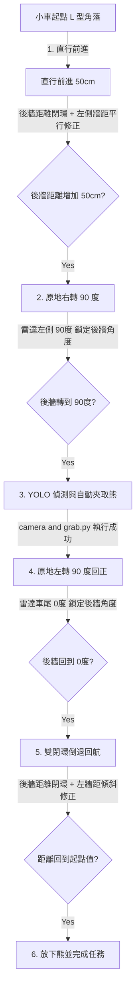

docker exec -it compose-kros_car-1 bash


python3 /workspaces/test_lidar_orientation.py

---

source /workspaces/install/setup.bash

python3 bridge_navigation_final_back.py


# 🤖 Wildbot 實體車「無 Nav2」光達定位與回航完全指南

本指南專為解決實體小車在**草地賽道上輪子打滑、Nav2 計算繁重、位置校正無法收斂**等競賽痛點而設計。我們完全移除了 Nav2，改用起點的 **L 型牆角** 作為絕對幾何基準，利用小車車尾朝後的光達（LiDAR）進行三維空間的雙閉環控制。

---

## 📐 1. 空間幾何與控制原理

由於小車採用二自由度控制（僅能控制前進速度 $v$ 與角速度 $\omega$，無法橫移），在草地上直行與自轉均會有嚴重的打滑隨機誤差。我們將起點的「後牆」與「左牆」當作燈塔，其控制原理如下：



### 🔹 直行與倒車的「平行與橫向修正」
我們在直行與倒車時，利用雷達讀取後牆（雷達 0 度附近）的法線偏角 $\theta_{rear}$，並將左側牆壁（雷達 90 度附近）的距離 $d_{left}$ 偏差轉化為目標偏角，實現無橫移能力下的斜向修正：

1. **去程直行前進**：
   $$\theta_{target} = K_y \cdot (d_{left} - d_{left\_init})$$
   $$\omega = - K_{yaw} \cdot (\theta_{rear} - \theta_{target})$$
   *當小車太偏右時（$d_{left} > d_{left\_init}$），小車會微調車頭向左偏，斜向左前方前進以靠近左牆。*

2. **回程倒車入庫**：
   $$\theta_{target} = - K_y \cdot (d_{left} - d_{left\_init})$$
   $$\omega = - K_{yaw} \cdot (\theta_{rear} - \theta_{target})$$
   *當小車太偏右時（$d_{left} > d_{left\_init}$），小車會微調車尾向左偏，斜向左後方倒車以靠近左牆。*

---

## 🛠️ 2. 單步調試工具 (LidarControlTest)

為了在比賽現場方便快速排查硬件與控制參數，我們建立了一個單步調試腳本 [test_lidar_control.py](file:///home/robot/wildbot_real%20car/wildbot_workspace-main/test_lidar_control.py)。請先啟動底盤與雷達驅動，再進入容器執行以下指令：

### 進入容器環境
```bash
docker exec -it compose-kros_car-1 bash
source /workspaces/install/setup.bash
```

### 1. 測試直行去程 (GO)
測試小車是否能利用後方光達，精準前進指定距離（例如 50cm）並自動煞車：
```bash
python3 /workspaces/test_lidar_control.py go 0.50
```

### 2. 測試原地右轉 90 度 (TURN_RIGHT)
測試小車是否能利用光達追蹤後牆，在轉到精準的 90 度時急煞：
```bash
python3 /workspaces/test_lidar_control.py turn_right
```

### 3. 測試原地左轉 90 度回正 (TURN_LEFT)
將小車手動放至右轉後的姿態，測試其是否能精準轉回面對起點：
```bash
python3 /workspaces/test_lidar_control.py turn_left
```

### 4. 測試雙閉環倒退回航 (BACK)
手動將小車放至前方（例如距離後牆 70cm 處），測試其是否能斜向修正並絲滑倒車回到起點：
```bash
python3 /workspaces/test_lidar_control.py back
```

---

## 🚀 3. 正式競賽協調器 (LidarCompetitionCoordinator)

我們實作了全新的任務協調器 [lidar_competition_coordinator.py](file:///home/robot/wildbot_real%20car/wildbot_workspace-main/workspaces/src/arm_ik/arm_ik/lidar_competition_coordinator.py)，它完全接管了整個任務狀態機，不需要 Nav2 即可自動完成「啟動 → 直行 → 右轉 → YOLO 找熊 → 夾取 → 轉回 → 雙閉環倒車 → 放物」的完整閉環任務。

> [!NOTE]
> **新版特點：光達與里程計 (Odom) 混合控制 (Hybrid Control)**
> * **起點內啟動**：小車會在啟動前 2.5 秒自動量測後牆與左牆距離，鎖定為本次任務的絕對基準值。
> * **起點外啟動**：若偵測到距離過大（大於 85cm），程式將印出警告並**自動切換為里程計 (Odom) 輔助控制**。去程直行、原地旋轉將由 Odom 執行；**回程倒車時，一旦小車退回並在雷達中偵測到起點牆壁（小於 85cm），系統會自動且無縫（Seamless）切換回「光達雙閉環高精度貼牆」**！這讓您在賽道任何位置調試測試都極為方便。

### 執行步驟：

#### 1. Terminal 1｜啟動底盤與雷達等硬體驅動（主機端）
```bash
cd "/home/robot/wildbot_real car/wildbot_workspace-main"
sudo ./scripts/00_start_all.sh
```

#### 2. Terminal 2｜啟動 YOLO 3D（主機端，不啟動 Nav2）
```bash
cd "/home/robot/wildbot_real car/wildbot_workspace-main"
./yolo_3d.sh
```

#### 3. Terminal 3｜啟動光達版任務協調器（進入容器）
```bash
docker exec -it -w /workspaces/workspaces/src/arm_ik/arm_ik/ compose-kros_car-1 bash
source /workspaces/install/setup.bash

# 執行協調器 (參數依序為：去程距離(m), 夾取停留距離(m), 夾取打滑補償)
python3 lidar_competition_coordinator.py 0.50 0.38 0.9615
```

---

## 💡 4. 比賽現場調優建議 (Tuning Tips)

> [!TIP]
> 1. **雷達噪聲過濾**：本腳本已內建 5 點滑動平均平滑濾波，若草地顛簸造成牆面數據跳動，可調整 `get_closest_point` 函數中的 `window_size` 參數。
> 2. **直行修正強度**：前進與倒車時，若發現小車修正方向的速度過慢或過快產生晃動，可微調控制迴圈中的 `kp_yaw` (預設 1.0) 與 `kp_y_align` (預設 45.0)。
> 3. **防燒毀安全提醒**：自動對齊成功並執行 `camera and grab.py` 時，該腳本內建了 0.5 秒後夾爪自動退回 2 度的保護邏輯，請務必保留。
