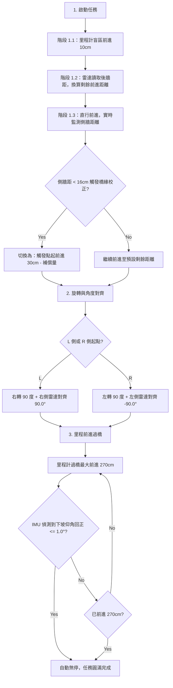

# 🤖 Wildbot 實體小車過橋自動導航任務說明

本文件說明自動過橋導航任務的物理幾何原理、核心控制邏輯與階段任務流程。本系統不依賴 Nav2 等繁重計算，完全採用 **「雷達閉環 + 里程計 (Odom) + 慣性測量單元 (IMU) 混合控制」** 的輕量化設計，解決輪子打滑、Nav2 無法收斂以及草地賽道等競賽痛點。

---

## 📐 1. 賽道環境與幾何基準

小車的任務是從起點出發，直行至橋的入口前，轉彎 90 度面向橋面，隨後開上橋並通過，最後在下橋回到平地時安全煞停。

```
【起點角落】
   │  ┌──────┐
   │  │ 小車 │
   │  └──────┘ ───> 前進 (GO)
   │ 
   └─────────────────────────────── (側牆)
                                
                                      【橋面】
                                    ┌───────────┐
                                    │           │
                                    │    橋     │
                                    │           │
```

* **起點定位**：利用起點的後牆與側邊牆壁作為絕對幾何座標基準。
* **物理盲區**：雷達在極近距離（如小於 10~15cm）時存在讀取盲區。
* **轉彎關係**：
  * **左側起點 (L)**：左側是牆，直行到中心後，橋在右側，故小車執行**右轉 90 度**。
  * **右側起點 (R)**：右側是牆，直行到中心後，橋在左側，故小車執行**左轉 90 度**。

---

## 🧠 2. 核心控制演算法與三階段邏輯



### 🚗 步驟一：二階段直行 + 側邊光達自動定位校正 (GO)
為了解決小車在草地上前進時的輪胎打滑誤差，此階段結合了里程計與光達距離的雙重比對：

1. **第一階段 (里程計避盲區)**：啟動時小車後方緊貼牆壁，雷達處於盲區。故先利用純里程計前進 10cm 避開死區，隨後自動讀取並過濾出可靠的車尾雷達距離。
2. **剩餘距離換算**：利用「後牆到橋中心總距離（預設 2.0m）」減去「當前車尾雷達實際測距」並扣除「光達至車體中心補償」，精確推算出第二階段需前進的剩餘距離。
3. **側邊雷達閉環校正 (檢測到橋邊緣即時覆蓋)**：
   * 在直行前進過程中，小車會不斷監控側邊牆壁（左側或右側）。
   * 當側邊牆壁距離突然小於閾值（預設 16cm）時，表示雷達已經檢測到了橋的入口邊緣。
   * 此時程式會**放棄原本的里程計剩餘距離**，直接改以「檢測觸發點的當前位置」為基準，繼續前進 30cm（扣除雷達與車體中心的補償距離），實現高精度的上橋前定位。

---

### 🔄 步驟二：里程計自轉 + 雷達精細閉環角度校正 (TURN)
大角度旋轉時如果僅用雷達容易丟失匹配。因此我們使用里程計與雷達混合的二階段對齊：

1. **第一階段 (里程計快速旋轉)**：根據起始設定執行原地快速左轉或右轉 90 度。轉彎的同時利用 `initial_rear` 原車尾後牆距離進行物理誤差校驗（例如右轉 90 度後，原本在後方的牆會移到右側，右側雷達應讀取到接近 `initial_rear` 的數值）。
2. **第二階段 (雷達閉環精細校正)**：
   * 當里程計到達 90 度後，小車會改為「比例控制 (P-Control)」，利用雷達角度誤差值控制自轉角速度。
   * **左側起點 (L)**：右轉後起點後牆在右側，故使用**右側光達**對齊 `90.0°`（誤差小於 1.5 度且連續穩定則煞停）。
   * **右側起點 (R)**：左轉後起點後牆在左側，故使用**左側光達**對齊 `-90.0°`（誤差小於 1.5 度且連續穩定則煞停）。
   * 此步驟能徹底消除里程計因打滑產生的自轉偏差，確保小車車頭以極高精度完全筆直朝向橋面。

---

### 🌉 步驟三：里程前進過橋 + 下坡仰角回正監測 (MOVE_ODOM)
因為上橋後小車與起點後牆之間被橋體隔開，雷達無法讀取有效距離，故此階段小車處於雷達盲區，改用里程計與 IMU 進行姿態控制：

1. **里程計過橋**：以設定的速度（預設 0.12 m/s）沿著橋身向前移動，設定過橋的最大行駛距離上限（預設 2.7m）。
2. **下坡 Pitch 仰角回正自動煞停 (Level stop)**：
   * **上橋段**：小車上坡時，IMU 讀取出的 Pitch 俯仰角會呈現負值。
   * **下坡段**：小車在橋的後半段下坡時，Pitch 俯仰角會變為正值（當大於等於預設下坡閥值 3.0° 時，程式正式標記「小車已處於下坡階段」）。
   * **回正即停**：處於下坡階段的小車一旦偵測到 Pitch 仰角降低至接近地平面的水平度數（預設小於等於 1.0°），即代表車身已安全落地。程式會立刻主動發布零速度指令（Software E-Stop）停止小車。
   * 該機制可防止因打滑導致小車衝出賽道，並以最快時間完成過橋任務。

---

## 🔒 3. 安全防護與診斷機制

在整個自動過橋任務流程中，程式在背景以 20Hz 頻率持續運行以下防護：

1. **一鍵緊急即停 (E-Stop)**：測試時若有任何碰撞風險，隨時按下**鍵盤 [空白鍵]**，程式會立即覆蓋速度並發布零速度（連續發送五次）來安全煞停小車。
2. **馬達過熱保護 (Thermal Lock)**：實時監控大臂、小臂與夾爪馬達溫度。一旦有任一馬達溫度達到 `70.0°C`，程式將發布即時錯誤日誌並強制切斷底盤運動，需等溫度回落至 `60.0°C` 以下方可解鎖。
3. **Foxglove 數據可視化**：在任務過程中，會將雷達實時測量出的前後左右四向距離獨立發布至 ROS2 話題中（`/lidar_dist/front`, `/lidar_dist/rear`, `/lidar_dist/left`, `/lidar_dist/right`），方便以可視化圖表與數值監控調參。
