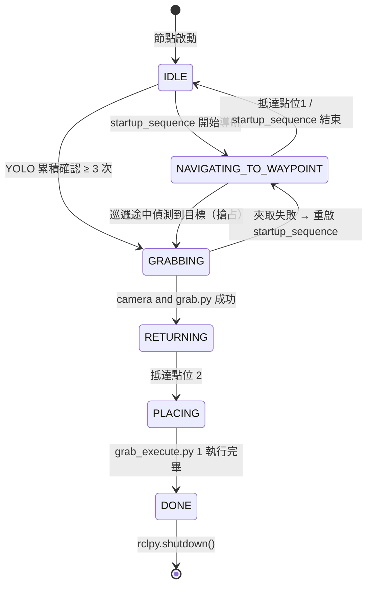

# 🐻 Wildbot 競賽黑熊自動化抓取策略與協調器指南

本文件記錄了 Wildbot 實體小車在面對競賽環境時的自主抓取架構，使用 `competition_coordinator.py` 作為任務總協調器。


## 啟動程式

### Terminal 1｜啟動所有硬體驅動（主機端）
```bash
cd "/home/robot/wildbot_real car/wildbot_workspace-main"
sudo ./scripts/00_start_all.sh
```
> 這會啟動底盤馬達控制器、手臂伺服馬達、雷達、深度相機與 EKF 定位節點。

---

### Terminal 2｜一鍵啟動 Nav2 + 初始定位 + YOLO 3D（主機端）
```bash
cd "/home/robot/wildbot_real car/wildbot_workspace-main"
./quick_start.sh
```

`quick_start.sh` 的內部執行順序：

| 步驟 | 動作                       | 說明                                                      |
| ---- | -------------------------- | --------------------------------------------------------- |
| 1    | 清理殘留行程               | 強制終止舊的 Nav2、YOLO 3D 行程                           |
| 2    | 啟動 Nav2（背景）          | 載入指定地圖，日誌存至 `/tmp/nav2.log`                    |
| 3    | 等待 5 秒                  | 確保訂閱者完成註冊                                        |
| 4    | 發布初始定位               | 自動向 `/initialpose` 發布原點 `(0, 0)`                   |
| 5    | 啟動 YOLO 3D（背景）       | 日誌存至 `/tmp/yolo_3d.log`                               |
| 6    | 驗證服務狀態（最多 25 秒） | 確認 `/planner_server` 與 `/yolo/yolo_node` 均為 `active` |

> [!NOTE]
> 停止所有背景服務：
> ```bash

> ./quick_start.sh stop
> 
> ```

---

### Terminal 3｜啟動任務協調器（進入容器）
```bash
docker exec -it compose-kros_car-1 bash
source /workspaces/install/setup.bash
cd /workspaces/workspaces/src/arm_ik/arm_ik/ && python3 competition_coordinator.py
```

啟動後協調器會自動執行：
1. 手臂初始化至點位 1（待機姿態）
2. 導航至 Nav2 點位 1（巡邏/等待區）
3. 進入待機，等待 YOLO 偵測到 `bear`

---


## 🎯 1. 核心任務策略與架構

任務分為以下三個主要階段：

### A. 啟動與定位階段
- 手臂移至點位 1（待機姿態），小車導航至 Nav2 **點位 1**（巡邏/等待區）。
- 抵達後進入待機（IDLE），持續等待 YOLO 偵測。

### B. 視覺偵測與夾取階段
- YOLO 連續確認 3 次以上後，呼叫 `camera and grab.py` 進行精準對齊與夾取。
- 夾取成功後回航。

### C. 回航與放物階段
- 導航至 Nav2 **點位 2**（起點/放物區），到達後手臂移回點位 1，夾爪張開完成放物。

---

## 🔄 2. 協調器狀態機 (State Machine)

協調器 (`competition_coordinator.py`) 維持以下狀態機：



### 📍 目標選擇策略
當畫面中同時出現多隻黑熊時，協調器會：
1. 篩選 `class_name == 'bear'` 且信心度 `≥ 0.65` 的目標
2. 確認目標在機器人前方（`pos.x > 0`）
3. 選擇**歐幾里得距離最近**的目標：$\text{dist}^2 = x^2 + y^2$

---

## 📋 3. 各階段詳細說明

### Phase 0｜初始化
| 項目     | 內容                               |
| -------- | ---------------------------------- |
| 目標標籤 | `'bear'`（硬編碼）                 |
| 訂閱話題 | `/yolo/detections_3d`              |
| 啟動行為 | 自動開啟 `startup_sequence` Thread |

---

### Phase 1｜啟動序列（`startup_sequence`）

```
Step 1｜subprocess: grab_execute.py 1
  → 手臂移至點位 1（待機姿態）
  → 失敗仍繼續，不中斷流程

Step 2｜subprocess: nav_execute.py 1
  → 導航至 nav_poses.json 的點位 1（巡邏/等待區）
  → finally: state = 'IDLE'（無論成敗）
```

---

### Phase 2｜YOLO 目標偵測（持續偵測）

> 只在 `IDLE` 或 `NAVIGATING_TO_WAYPOINT` 狀態下觸發

```
收到 /yolo/detections_3d
  ↓
篩選條件：class_name == 'bear'，score ≥ 0.65，pos.x > 0
  ↓
連續未偵測 → count 遞減（防誤觸）
連續偵測到 → count 遞增（上限 10）
  ↓
count < 3 → 等待累積
count ≥ 3 → ✅ 鎖定！
  ↓
若正在 NAVIGATING_TO_WAYPOINT（startup_sequence 途中）：
  → 發送剎車指令 + 取消 Nav2 Goal（搶占）
  ↓
觸發 trigger_grab_sequence()
```

---

### Phase 3｜夾取序列（`_grab_thread`）

```
state = 'GRABBING'
等待 1 秒（讓底盤靜止）
  ↓
subprocess: "camera and grab.py" <slip_factor>
  → 精準對齊與機械手臂夾取
  ↓
returncode == 0 → ✅ 成功 → return_home()
returncode != 0 → ❌ 失敗
  → detect_consecutive_count = 0
  → 重新執行 startup_sequence()
```

`camera and grab.py` 的內部夾取流程：
1. 手臂移至點位 1（觀察位）
2. 左右旋轉對齊（相機中心校正）
3. 計算前進距離，里程計控制逼近
4. 手臂移至點位 2（夾取位），閉合夾爪
5. 0.5 秒後退回 2°（防燒毀）
6. 手臂移至點位 3（抬升運送位）

---

### Phase 4｜回航（`_return_home_thread`）

```
state = 'RETURNING'
  ↓
clear_costmaps()（清除殘留障礙物）
  ↓
subprocess: nav_execute.py 2
  → 導航至 nav_poses.json 的點位 2（起點/放物區）
  ↓
成功 → trigger_place_sequence()
失敗 → state = 'IDLE'
```

---

### Phase 5｜放物（`_place_thread`）

```
state = 'PLACING'
  ↓
subprocess: grab_execute.py 1
  → 手臂移至點位 1（夾爪張開，釋放物件）
  ↓
state = 'DONE' → sleep(1s) → rclpy.shutdown()
```

---

## 📁 4. 依賴腳本與 JSON 點位

### 依賴腳本

| 腳本                 | 呼叫時機                          | 傳入參數      |
| -------------------- | --------------------------------- | ------------- |
| `grab_execute.py 1`  | Phase 1 手臂初始化 / Phase 5 放物 | 點位編號 `1`  |
| `nav_execute.py 1`   | Phase 1 導航至巡邏區              | 點位編號 `1`  |
| `camera and grab.py` | Phase 3 夾取                      | `slip_factor` |
| `nav_execute.py 2`   | Phase 4 回航                      | 點位編號 `2`  |

### JSON 點位需求

| 檔案             | 需要的點位 key | 用途                          |
| ---------------- | -------------- | ----------------------------- |
| `arm_poses.json` | `"1"`          | 手臂待機/放物姿態（夾爪張開） |
| `arm_poses.json` | `"2"`          | 夾取點位（夾爪閉合位）        |
| `arm_poses.json` | `"3"`          | 抬升運送位                    |
| `nav_poses.json` | `"1"`          | 巡邏/等待區座標               |
| `nav_poses.json` | `"2"`          | 起點/放物區座標               |

---

## 🚀 5. 完整啟動步驟

### Step 1｜啟動所有硬體驅動（主機端）
```bash
cd "/home/robot/wildbot_real car/wildbot_workspace-main"
sudo ./scripts/00_start_all.sh
```

### Step 2｜啟動 YOLO 3D + Nav2（容器內）
```bash
docker exec -it compose-kros_car-1 bash

# 啟動導航與 YOLO（使用快速啟動腳本）
./quick_start.sh /workspaces/maps/my_map.yaml
```

### Step 3｜啟動任務協調器（容器內另開終端）
```bash
docker exec -it compose-kros_car-1 bash
source /workspaces/install/setup.bash
cd /workspaces/workspaces/src/arm_ik/arm_ik/

# 直接執行，目標標籤已固定為 'bear'
python3 competition_coordinator.py

# 可選：調整停留距離與打滑補償
python3 competition_coordinator.py 0.38 1.0
```

---

## ⚠️ 6. 安全防護規範

### 關節角度限制
| 關節            | 最小角度             | 最大角度     | 備註          |
| --------------- | -------------------- | ------------ | ------------- |
| `arm_1_joint`   | 30°                  | 210°         | 避免碰撞地板  |
| `arm_2_joint`   | 0°                   | 240°         | 避免碰撞地板  |
| `gripper_joint` | **168°（絕對下限）** | 240°（全開） | 嚴禁低於 168° |

> [!CAUTION]
> 夾爪角度**嚴禁小於 168°**，否則會造成馬達過夾/堵轉燒毀。夾爪閉合後務必在 0.5 秒內自動退回至少 2°。

### 溫度監控
| 狀態     | 溫度臨界值 | 行為                          |
| -------- | ---------- | ----------------------------- |
| 警告     | ≥ 65°C     | 終端機顯示警告訊息            |
| 強制停機 | ≥ 70°C     | Software E-Stop，攔截所有指令 |
| 自動恢復 | ≤ 60°C     | 解除鎖定，恢復正常運作        |

---

## 💡 7. 盲區設計說明

當小車逼近黑熊時，最後約 10 cm 目標物會進入相機盲區。現有設計透過以下機制確保夾取成功：

1. **距離鎖定機制**：逼近距離在旋轉對齊完成後一次性計算並鎖定，之後由里程計（Odometry）控制前進，不依賴相機。
2. **座標記憶保護**：若 YOLO 偵測為 `None`，歷史座標值不被覆蓋，維持最後一次看見的數值。
3. **盲夾點位**：最後由手臂預設點位 2 執行夾取，無需視覺參考。